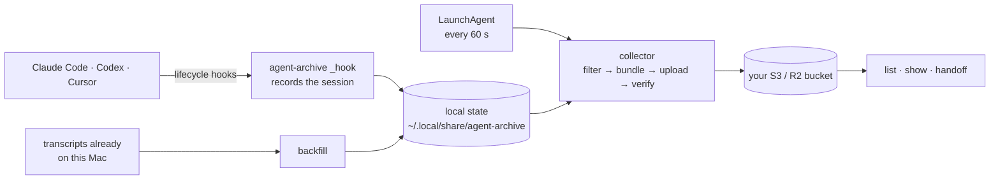

# agent-archive

[](https://github.com/wangjohn/agent-archive/actions/workflows/test.yml)
[](go.mod)
[](LICENSE)

Keep your Claude Code, Codex, and Cursor sessions in a bucket you own, so you
can search them, compare them, and hand one agent's work to another.

`agent-archive` is a small macOS command-line tool. It hooks into each app,
filters every session's transcript, and uploads it to your private Cloudflare
R2 or Amazon S3 bucket. There is no account, hosted service, or telemetry.

> **Status: beta.** Interfaces and the bucket layout may still change before
> `v1.0`.

## Quickstart

1. **Install** (macOS, Apple Silicon or Intel):

   ```sh
   curl -fsSL https://raw.githubusercontent.com/wangjohn/agent-archive/main/install.sh | sh
   ```

   Or [build from source](docs/getting-started/install.md#build-from-source).

2. **Create a private bucket** and an access key for it: a few clicks in
   Cloudflare R2 or AWS ([how](docs/getting-started/bucket.md)).

3. **Run setup** from inside a project you want archived:

   ```sh
   cd ~/code/my-project
   agent-archive setup
   ```

4. **Approve the hooks** if an app asks (in Codex: `/hooks`), then start a
   **new** session. Sessions already open aren't captured.

5. **Check it:** once that session has run for a minute or two,
   `agent-archive status` should say `Ready`; anything else comes with a
   `Next:` step. Optionally, `agent-archive backfill` imports the sessions
   already on this Mac.

To add a second Mac, install and run setup there with the same bucket
([multiple Macs](docs/guides/multiple-macs.md)).

## Commands

| Command | What it does |
| --- | --- |
| `setup` | First-time setup, or change apps, projects, storage, or retention. |
| `status` | Storage, collector, hooks, and capture health, with a `Next:` step. |
| `list`, `show` | Browse archived sessions (`--json` for scripts). |
| `handoff` | Print a session as a prompt another agent can continue from. |
| `backfill` | Import sessions already on this Mac; `backfill undo` removes them. |
| `sync` | Collect and upload now instead of waiting for the next pass. |
| `pause`, `resume` | Suspend and restore capture. |
| `feedback` | Attach your own rating or note to a session. |
| `uninstall` | Remove hooks and the collector. Never touches the bucket. |

`agent-archive help COMMAND` shows options and examples; the
[CLI reference](docs/reference/cli.md) lists every flag and exit code.

## What leaves your Mac

- **Sessions, filtered**, only for projects you include: prompts, replies,
  tool calls and results, working directories, branch names, models, and
  token counts.
- **Installed skills:** the text of each `SKILL.md` the app can see.
- **Never:** hidden reasoning, system instructions, images and other binary
  content, or any field the filter doesn't recognize.
- **Redacted, best effort:** credentials with a recognizable name or shape
  (API keys, tokens, passwords, private keys). A secret with neither is
  archived as it appears.
- **Only to your bucket**, unencrypted by agent-archive: anyone who can read
  the bucket can read your sessions. Keep it private and use
  [narrow credentials](docs/security/bucket-permissions.md).

The [privacy](docs/security/privacy.md) page has the details and where the
protections stop.

## How it works



Setup edits only the `hooks` entry of each app's settings file and adds one
LaunchAgent ([everything it changes](docs/getting-started/setup.md#what-setup-changes-on-your-mac)).
Old sessions are deleted from the bucket after 90 days by default.

## Requirements

- macOS, Apple Silicon or Intel.
- A Cloudflare R2 or Amazon S3 bucket.
- Claude Code 2.1.x, Codex CLI 0.155, or Cursor 3.21. Other versions are
  reported as `unverified` rather than assumed to work
  ([tested versions](docs/reference/capture-capabilities.md#tested-app-versions)).

## Documentation

[Install](docs/getting-started/install.md) ·
[Setup](docs/getting-started/setup.md) ·
[Troubleshooting](docs/guides/troubleshooting.md) ·
[FAQ](docs/guides/faq.md) ·
[Privacy](docs/security/privacy.md) ·
[All docs](docs/README.md)

## Contributing

See [CONTRIBUTING.md](CONTRIBUTING.md); never test against your real Mac
([sandbox recipe](docs/contributing/testing.md)). Report vulnerabilities
privately as [SECURITY.md](SECURITY.md) describes. Changes are in
[CHANGELOG.md](CHANGELOG.md). Released under the [MIT License](LICENSE).
