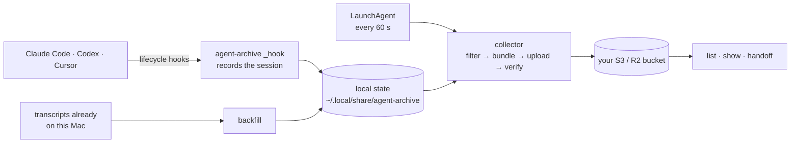

# agent-archive

[](https://github.com/wangjohn/agent-archive/actions/workflows/test.yml)
[](go.mod)
[](LICENSE)

Keep your Claude Code, Codex, and Cursor sessions in a bucket you own, so you
can search them, compare them, and hand one agent's work to another.

`agent-archive` is a small macOS command-line tool. It installs lifecycle
hooks in each app, runs a background collector that filters each session's
transcript and uploads it with its metadata to a private Cloudflare R2 or
Amazon S3 bucket, and deletes old sessions on a retention schedule. There is
no account, hosted service, or telemetry.

> **Status: pre-release.** There is no signed release yet — build from
> source. Interfaces and the bucket layout may still change before `v0.1.0`.

## What leaves your Mac

- **Your sessions, filtered:** prompts, the agent's replies, tool calls with
  their arguments and results (commands, file paths, edit bodies), working
  directories (which usually contain your username), Git branch names,
  models, and token counts. Only projects you include are captured.
- **Your installed skills, with every session:** the text (up to 16 KB
  each, filtered) of each `SKILL.md` in the app's user-level skill folders
  (`~/.claude/skills`, `~/.agents/skills`, `~/.codex/skills`,
  `~/.cursor/skills`) as well as the project's own, whatever the project.
  There is no switch to turn this off.
- **Identifiers:** a random machine ID made at setup, a hash of the project
  path, the app's version, and its session IDs.
- **Kept out:** hidden reasoning, system and injected instructions, images
  and other binary content, and every field the filter doesn't know.
- **Redacted, best effort:** recognizable credentials (`DB_PASSWORD=…`,
  `"api_key": …`, AWS keys, GitHub and Slack tokens, private keys, JWTs,
  passwords in URLs). A secret with no recognizable name or shape is archived
  as it appears.
- **Only to your bucket.** There is no client-side encryption: anyone who can
  read the bucket can read your sessions. Use narrow credentials
  ([bucket permissions](docs/security/bucket-permissions.md)).
- **On your Mac,** it edits the `hooks` entry of each app's settings file,
  adds one LaunchAgent, and keeps its state in `~/.local/share/agent-archive`
  ([everything it changes](docs/getting-started/setup.md#what-setup-changes-on-your-mac)).

Details, and where the protections stop: [privacy](docs/security/privacy.md).

## How it works



The [architecture](docs/contributing/architecture.md) page has the details.

## Quickstart

```sh
git clone https://github.com/wangjohn/agent-archive.git
cd agent-archive
VERSION=dev ./scripts/build-release.sh              # needs Go 1.27.1 and Xcode command line tools
sudo mkdir -p /usr/local/bin                        # may not exist on Apple Silicon
sudo mv ./dist/agent-archive-darwin-$(uname -m | sed 's/x86_64/amd64/') /usr/local/bin/agent-archive
# or, without sudo, any directory on your PATH (with Homebrew on Apple Silicon: /opt/homebrew/bin)

agent-archive setup          # choose apps and projects, connect a private bucket
# Approve the new hooks in each app if it asks (in Codex: /hooks). Until you
# do, the app doesn't run them and nothing is captured.
agent-archive status         # check capture, then start a new agent session
agent-archive backfill       # optional: import sessions already on this Mac
```

You need an existing private R2 or S3 bucket. See
[install](docs/getting-started/install.md) and
[setup](docs/getting-started/setup.md).

What `status` looks like once a first session is published and verified
(an example: the layout is the real one, the values are made up):

```text
Agent Archive — Ready

Storage:       s3 / my-archive-bucket / agent-archive/
Access:        confirmed 2026-09-21T12:00:00Z by the collector's last successful storage access
Bucket privacy: native public access blocked at the last check.
  Checked: 2026-09-21T11:58:00Z; all_bucket_public_access_blocks_enabled.
  Review: https://docs.aws.amazon.com/AmazonS3/latest/userguide/access-control-block-public-access.html
Authentication: verified (checked 2026-09-21T12:00:00Z; background_collector)
Background:    loaded
Projects:      1 included
Pending:       0 session(s)
Last scan:     2026-09-21T12:00:00Z
Last publish:  2026-09-21T11:57:00Z
Codex: published; source verified (1 session(s)); hooks installed
  Hook trust: unknown here; it is granted inside the app and is not observable from this Mac's files.
  Installed version: 0.155.0; support verified_by_capture.
  Project /Users/you/code/my-project: verified_at_recorded_time.
  Read-back verified: 2026-09-21T11:58:00Z; evidence is for that publication.

Next: Keep working. Run agent-archive list to inspect archived sessions.
```

Anything but `Ready` comes with a `Next:` line saying what to do;
[troubleshooting](docs/guides/troubleshooting.md#reading-status) explains
each line. And `list`:

```text
SESSION                           HARNESS  CAPTURED              ORIGIN  PARSER   MODELS    SKILLS USED
d0a8124edb786e5686a068deca82e04f  codex    2026-09-21T11:57:00Z  hook    partial  gpt-5     -
1 session(s).
```

`HARNESS` is the app; `ORIGIN` is `hook` for a session captured as it ran
and `import` for one `backfill` brought in; `PARSER` says how far the
derived counts can be trusted (`complete`, `partial`, or `failed`). The
[glossary](docs/reference/glossary.md) defines these and the other terms
agent-archive uses.

## Commands

- `setup` guides first-time setup or a safe reconfiguration.
- `status` shows storage, collector, hooks, and capture coverage.
- `sync` runs one collection and upload pass now.
- `pause` and `resume` suspend and restore scheduled work.
- `list` and `show` inspect archived sessions from the bucket, metadata first. `list --json`, `show`, and `status --json` print JSON for scripts ([JSON output](docs/reference/json-output.md)).
- `handoff` prints a session as a prompt another coding agent can continue from, on this Mac or another.
- `backfill` imports the sessions already on this Mac after showing a plan; `backfill history` and `backfill undo` review and remove imports.
- `feedback` attaches your own assessment to a session.
- `uninstall` removes hooks and the collector; `--delete-local-data` also removes local data. It never touches the bucket.

Run `agent-archive` or `agent-archive help` for a short guide, `agent-archive
help COMMAND` or `agent-archive COMMAND --help` for options and examples, and
`agent-archive --version` for the version. Every command, flag, and exit
code is in the [CLI reference](docs/reference/cli.md).

## Supported platforms

- macOS on Apple Silicon and Intel. Linux builds and tests run in CI, but
  capture is macOS-only (launchd, Keychain).
- Storage: Cloudflare R2, Amazon S3.
- Apps: Claude Code, Codex, and Cursor. Versions the adapters were built
  and checked against: Claude Code 2.1.x, Codex CLI 0.155, Cursor 3.21.13
  ([tested versions](docs/reference/capture-capabilities.md#tested-app-versions)).
  Other versions are reported as `unverified` rather than assumed to work.
- Not supported: Linux and Windows. Linux builds exist so the tests run
  in CI, but capture depends on launchd and the Keychain.

## Documentation

The [documentation index](docs/README.md) lists every guide and reference
page. Start with [install](docs/getting-started/install.md),
[privacy](docs/security/privacy.md), and
[troubleshooting](docs/guides/troubleshooting.md); the
[glossary](docs/reference/glossary.md) defines the terms.

## Contributing and security

See [CONTRIBUTING.md](CONTRIBUTING.md) — never test against your real Mac;
the [testing](docs/contributing/testing.md) page has a sandbox recipe.
Report vulnerabilities privately as [SECURITY.md](SECURITY.md) describes.
Changes are recorded in [CHANGELOG.md](CHANGELOG.md). This project follows a
[code of conduct](CODE_OF_CONDUCT.md).

This CLI was developed inside
[wangjohn/agent-skills](https://github.com/wangjohn/agent-skills) before
moving to its own repository in September 2026. It is released under the
[MIT License](LICENSE).
