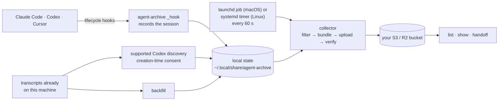
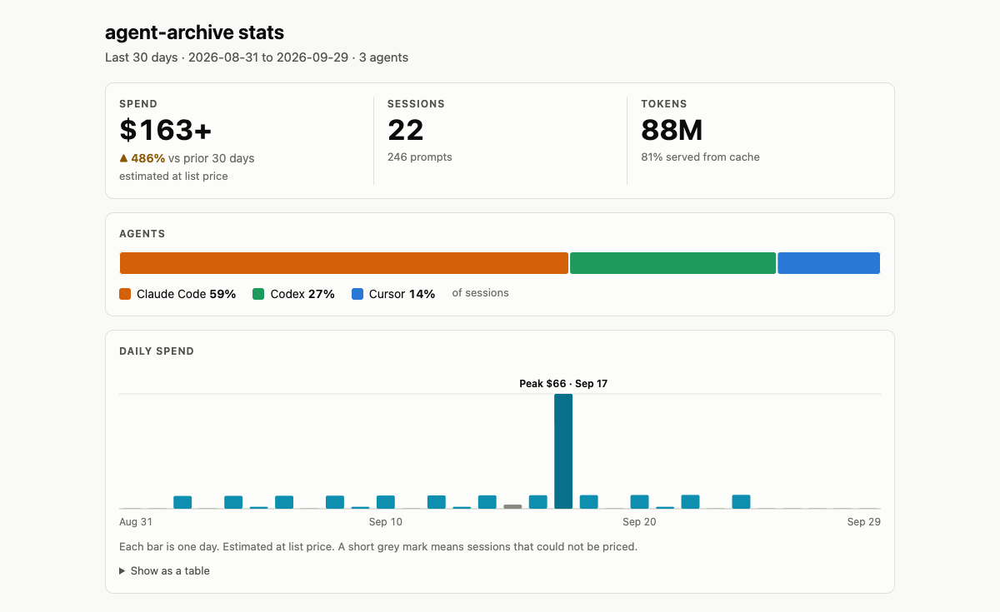

# agent-archive

[](https://github.com/wangjohn/agent-archive/actions/workflows/test.yml)
[](go.mod)
[](LICENSE)

**Keep your coding context when you switch agents.**

agent-archive helps you continue Claude Code, Codex, and Cursor conversations
across agents and machines, with searchable history stored in your own S3 or
R2 bucket. There is no agent-archive account, hosted service, or telemetry.

> **Status: beta.** The latest published release is **v0.1.1 (macOS)**.
> This README describes current source. Automatic agent launching, handoff
> before setup, Linux support, and stats require a source build until the next
> release. Interfaces and the bucket layout may change before v1.0.

- **Continue in another agent.** Hand Claude Code's conversation to Codex
  when you hit a usage limit or want another agent's help.
- **Find earlier work.** Search sessions by words, project, branch, or PR,
  or ask your agent to pull a past conversation into context.
- **Keep history across machines.** Capture sessions into a bucket you own
  and retrieve them on another configured computer.
- **Understand your workflow.** Inspect token usage and estimated costs,
  or export filtered sessions for an evaluation tool.

Handoff transfers filtered conversation context. Repository files, uncommitted
changes, processes, and agent runtime state are not transferred; prepare the
receiving checkout separately. [Handoff guide](docs/guides/handoff.md).

## Install the published release

The current release supports macOS:

```sh
curl -fsSL https://raw.githubusercontent.com/wangjohn/agent-archive/v0.1.1/install.sh | AGENT_ARCHIVE_VERSION=v0.1.1 sh
```

Follow the [v0.1.1 getting-started guide](https://github.com/wangjohn/agent-archive/blob/v0.1.1/README.md#quickstart)
for that release. Linux currently requires a source build.

## Try current source

The following steps use current source, not the v0.1.1 download.

1. **Build and install from source** on macOS or Linux:

   ```sh
   git clone https://github.com/wangjohn/agent-archive.git
   cd agent-archive
   ./scripts/install-from-source.sh
   export PATH="$HOME/.local/share/agent-archive-dev/bin:$PATH"
   agent-archive --version
   ```

   [Build requirements and development installation](docs/getting-started/install.md#build-from-source).
   A source build is a development binary, not a signed release candidate.

2. **With a source build, try a local handoff** inside a project:

   ```sh
   agent-archive handoff
   ```

   Choose an existing Claude Code or Codex conversation without configuring
   storage. The receiving agent must be installed.
   [Local scope and limits](docs/guides/handoff.md#before-setup-native-local-sessions).

3. **Create a private bucket** and an access key for it ([R2 and S3 steps](docs/getting-started/bucket.md)).

4. **Review [what is uploaded](docs/security/privacy.md#what-is-uploaded)** before enabling capture. Capture includes your conversation and can include user-level skill evidence; fresh setup keeps skill names and hashes by default. Redaction is best effort and there is no client-side encryption. **Run setup** inside a project you want to include, or choose projects when prompted ([setup guide](docs/getting-started/setup.md)):

   ```sh
   agent-archive setup
   ```

5. **Review capture scope and start a new task.** Included projects are the
   default. Codex can also capture all current and future projects when you
   explicitly approve that scope, with configured exclusions. Its supported
   automatic discovery works without hook approval; `/hooks` approval is needed
   for hook capture. Start a new task in the approved scope and send a prompt.
   [Consent, app-specific steps, and discovery limits](docs/getting-started/setup.md#automatic-codex-discovery).

6. **Verify capture.** Allow the background collector to run, or run `agent-archive sync`, then `agent-archive status`. Look for your app's **archived, verified** Capture row: this establishes publication and read-back. Find the new session with `agent-archive list` and inspect it with `agent-archive show SESSION_ID` ([first successful capture and troubleshooting](docs/README.md#first-successful-capture)).

To add a second machine, install and run setup there with the same bucket (see [multiple machines](docs/guides/multiple-machines.md)).

**Platforms.** macOS (Apple Silicon and Intel) and Linux (x86-64 and arm64) capture in the background. On Linux the collector is a systemd user timer, which needs systemd 240 or newer and a user manager (`loginctl enable-linger` on a headless machine); R2 credentials are kept in a private file rather than the Keychain; and Cursor capture is best effort, because the real Cursor app and `cursor-agent` hooks have not been verified there. Windows is not supported. [What was tested, and what was not](docs/getting-started/install.md#platforms).

## How it works


```mermaid
flowchart LR
  A["Claude Code · Codex · Cursor"] -- "lifecycle hooks" --> H["agent-archive _hook<br/>records the session"]
  H --> S[("local state<br/>~/.local/share/agent-archive")]
  L["launchd job (macOS) or<br/>systemd timer (Linux)<br/>every 60 s"] --> C["collector<br/>filter → bundle → upload → verify"]
  S --> C
  T --> D["supported Codex discovery<br/>creation-time consent"] --> S
  C --> B[("your S3 / R2 bucket")]
  B --> R["list · show · handoff"]
  T["transcripts already<br/>on this machine"] --> BF["backfill"] --> S
```

Setup edits each included app's hook settings, adds one background job (a LaunchAgent on macOS, a systemd user timer on Linux), and writes two skill files for Claude Code (in `~/.claude/skills`) and two for Codex and Cursor together (in `~/.agents/skills`; `agent-archive setup --no-skills` skips them); for Cursor it also adds a missing `version` field ([everything it changes](docs/getting-started/setup.md#what-setup-changes-on-your-machine)). Old sessions are deleted from the bucket after 90 days by default.

## Usage at a glance



Example data from the [shareable report fixture](internal/statshtml/testdata/shareable.html.golden).
Stats requires current source; costs are estimates at list price, not a bill.

## Commands and docs

| Command | What it does | Example |
| --- | --- | --- |
| `setup` | Configure apps, projects, and storage. | `agent-archive setup` |
| `status` | Check capture health and see what to do next; `status claude` shows one app in full. | `agent-archive status` |
| `sync` | Collect and upload pending sessions now. | `agent-archive sync` |
| `list` | Find archived sessions, by filters or by a few words. | `agent-archive list "retention"` |
| `show` | View a session's summary, or its transcript with `--transcript`. | `agent-archive show SESSION_ID` |
| `stats` | See your usage: tokens by day, estimated cost, agents, models, projects, highlights. | `agent-archive stats --days 7` |
| `backfill` | Preview sessions already on this machine for import. | `agent-archive backfill --dry-run` |
| `handoff` | Continue a session in another agent; inside Claude Code, `/handoff codex`. | `agent-archive handoff` |

Setup also gives Claude Code, Codex, and Cursor an `agent-archive` skill, so you can ask an agent to "pull in the auth session from Codex" and it runs the read-only commands for you; Claude Code asks before it first uses the skill and before it runs its commands ([agent skills](docs/guides/agent-skills.md#permissions)). After upgrading, `install.sh` runs `agent-archive setup --refresh` to keep the skills current.

Listings return at most 50 matching sessions by default: text shows top-level sessions by last activity; JSON includes subagents and sorts by capture time. For analytics over every match, use `agent-archive list --json --limit 0`; add `--all-projects` to include every project when running inside a repository, and `--replays include` if your analysis should include replay sessions (hidden by default). Unreadable metadata is skipped with a warning on stderr ([list guide](docs/guides/list-and-show.md), [JSON contract](docs/reference/json-output.md)).

Use a session ID from `list` with `show`. For every command and option, see the **[full CLI reference](docs/reference/cli.md)** or run `agent-archive help COMMAND`.

[Install](docs/getting-started/install.md) ·
[Setup](docs/getting-started/setup.md) ·
[Troubleshooting](docs/guides/troubleshooting.md) ·
[FAQ](docs/guides/faq.md) ·
[Privacy](docs/security/privacy.md) ·
[All docs](docs/README.md)

## Contributing and security

See [CONTRIBUTING.md](CONTRIBUTING.md); test without touching your real machine ([sandbox recipe](dev/contributing/testing.md)). Report vulnerabilities privately as [SECURITY.md](SECURITY.md) describes. Changes are in [CHANGELOG.md](CHANGELOG.md). Released under the [MIT License](LICENSE).
