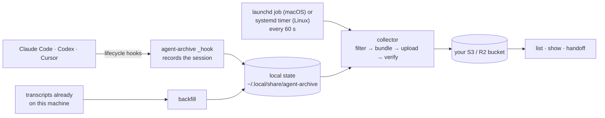

# agent-archive

[](https://github.com/wangjohn/agent-archive/actions/workflows/test.yml)
[](go.mod)
[](LICENSE)

A lightweight CLI that hooks into Claude Code, Codex, and Cursor sessions and stores them in cloud storage (S3 or R2).

OpenAI and Anthropic are constantly one-upping each other or the best model, but it's a pain to switch between their coding agents. Every time you switch, you lose your history, and then don't have a single source of truth for where all your sessions live. Also, if you run out of limits in the middle of a session, it's very annoying to have to figure out how to hand that session over to the other coding agent.

`agent-archive` solves these problems, and can perform the following:

- Automatically upload Claude Code, Codex, and Cursor transcripts into a cloud object storage like S3 or R2.
- Hand off a session from one coding agent to another. Type `/handoff codex` in Claude Code (or ask for `$handoff` in Codex) and Codex opens in a new terminal tab or window with the session as its context (on Linux, a new tmux window; outside tmux it prints the command to paste); from a terminal, run `agent-archive handoff`, pick a session (press `/` and type a few words, a PR number, or a branch to narrow the list), and press Enter. Or name it: `agent-archive handoff "flaky retention"`. No copying and pasting. Useful especially if you run into rate limits halfway through a session ([handoff guide](docs/guides/handoff.md)).
- Pull a past session into the agent you are in, by asking. Setup gives Claude Code, Codex, and Cursor an `agent-archive` skill, so "pull in the auth session from Codex" or "continue where my other agent left off" finds the session by a word or two (its name, branch, project, or PR number) and hands it to the agent as context, without you typing a command ([agent skills](docs/guides/agent-skills.md)).
- Hand off a session from one computer to another with the same `agent-archive handoff`. When working locally across multiple computers, agent-archive makes it very easy to continue sessions and to keep a single source of truth for all of your sessions.
- View all of your past sessions across coding agents with `agent-archive list` (from inside a repository it shows that repository's sessions first; `agent-archive list "retention"` finds one by words). This allows you to set up automations to understand how you're using your agents, how different coding agents perform across different tasks, and can help you perform meta-improvements on your AGENTS.md and lint rules that span across Claude Code, Codex, and Cursor.

## Quickstart

1. **Install** on macOS or Linux (details and what is verified: [platforms](docs/getting-started/install.md#platforms)):

   ```sh
   curl -fsSL https://raw.githubusercontent.com/wangjohn/agent-archive/v0.1.1/install.sh | AGENT_ARCHIVE_VERSION=v0.1.1 sh
   ```

   v0.1.1 has no Linux binary, so that command is for macOS. On Linux, drop the two pins (`install.sh | sh`) once the latest release has Linux binaries, or [build from source](docs/getting-started/install.md#build-from-source).

2. **Try a local handoff before setup** inside a project:

   ```sh
   agent-archive handoff
   ```

   Browse existing Claude Code or Codex conversations without configuring storage.
   [Local handoff scope, preview limits and cleanup](docs/guides/handoff.md#before-setup-native-local-sessions).

3. **Create a private bucket** and an access key for it ([R2 and S3 steps](docs/getting-started/bucket.md)).

4. **Review [what is uploaded](docs/security/privacy.md#what-is-uploaded)** before enabling capture. Redaction is best effort and there is no client-side encryption. **Run setup** inside a project you want to include, or choose projects when prompted ([setup guide](docs/getting-started/setup.md)):

   ```sh
   agent-archive setup
   ```

5. **Complete setup's per-app steps.** In Codex, run `/hooks` and approve the archive hooks. Start a **new** Claude Code or Codex session, or a new Cursor Agent chat, in an included project and send a prompt ([after setup](docs/getting-started/setup.md#after-setup)).

6. **Verify capture.** Allow the background collector to run, or run `agent-archive sync`, then `agent-archive status`. Look for your app's **archived, verified** Capture row: this establishes publication and read-back. Find the new session with `agent-archive list` and inspect it with `agent-archive show SESSION_ID` ([first successful capture and troubleshooting](docs/README.md#first-successful-capture)).

To add a second machine, install and run setup there with the same bucket (see [multiple machines](docs/guides/multiple-machines.md)).

**Platforms.** macOS (Apple Silicon and Intel) and Linux (x86-64 and arm64) capture in the background. On Linux the collector is a systemd user timer, which needs systemd 240 or newer and a user manager (`loginctl enable-linger` on a headless machine); R2 credentials are kept in a private file rather than the Keychain; and Cursor capture is best effort, because the real Cursor app and `cursor-agent` hooks have not been verified there. Windows is not supported. [What was tested, and what was not](docs/getting-started/install.md#platforms).

## How it works


```mermaid
flowchart LR
  A["Claude Code · Codex · Cursor"] -- "lifecycle hooks" --> H["agent-archive _hook<br/>records the session"]
  H --> S[("local state<br/>~/.local/share/agent-archive")]
  L["launchd job (macOS) or<br/>systemd timer (Linux)<br/>every 60 s"] --> C["collector<br/>filter → bundle → upload → verify"]
  S --> C
  C --> B[("your S3 / R2 bucket")]
  B --> R["list · show · handoff"]
  T["transcripts already<br/>on this machine"] --> BF["backfill"] --> S
```

Setup edits each included app's hook settings, adds one background job (a LaunchAgent on macOS, a systemd user timer on Linux), and writes two skill files for Claude Code (in `~/.claude/skills`) and two for Codex and Cursor together (in `~/.agents/skills`; `agent-archive setup --no-skills` skips them); for Cursor it also adds a missing `version` field ([everything it changes](docs/getting-started/setup.md#what-setup-changes-on-your-machine)). Old sessions are deleted from the bucket after 90 days by default.

## Commands and docs

| Command | What it does | Example |
| --- | --- | --- |
| `setup` | Configure apps, projects, and storage. | `agent-archive setup` |
| `status` | Check capture health and see what to do next; `status claude` shows one app in full. | `agent-archive status` |
| `sync` | Collect and upload pending sessions now. | `agent-archive sync` |
| `list` | Find archived sessions, by filters or by a few words. | `agent-archive list "retention"` |
| `show` | View a session's summary, or its transcript with `--transcript`. | `agent-archive show SESSION_ID` |
| `stats` | See your usage: tokens by day, estimated cost, agents, models, projects, highlights. | `agent-archive stats --days 7` |
| `backfill` | Preview sessions already on this machine for import. | `agent-archive backfill --dry-run` |
| `handoff` | Continue a session in another agent; inside Claude Code, `/handoff codex`. | `agent-archive handoff` |

Setup also gives Claude Code, Codex, and Cursor an `agent-archive` skill, so you can ask an agent to "pull in the auth session from Codex" and it runs the read-only commands for you; Claude Code asks before it first uses the skill and before it runs its commands ([agent skills](docs/guides/agent-skills.md#permissions)). After upgrading, `install.sh` runs `agent-archive setup --refresh` to keep the skills current.

Use a session ID from `list` with `show`. For every command and option, see the **[full CLI reference](docs/reference/cli.md)** or run `agent-archive help COMMAND`.

[Install](docs/getting-started/install.md) ·
[Setup](docs/getting-started/setup.md) ·
[Troubleshooting](docs/guides/troubleshooting.md) ·
[FAQ](docs/guides/faq.md) ·
[Privacy](docs/security/privacy.md) ·
[All docs](docs/README.md)

## Contributing and security

See [CONTRIBUTING.md](CONTRIBUTING.md); test without touching your real machine ([sandbox recipe](dev/contributing/testing.md)). Report vulnerabilities privately as [SECURITY.md](SECURITY.md) describes. Changes are in [CHANGELOG.md](CHANGELOG.md). Released under the [MIT License](LICENSE).
