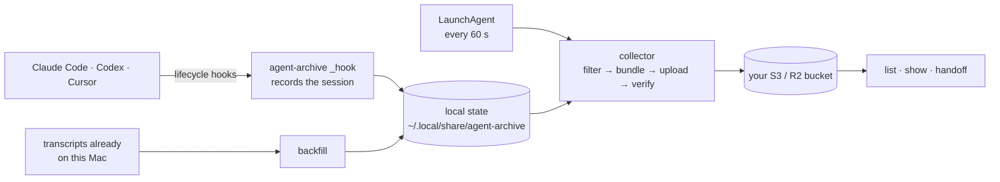

# agent-archive

[](https://github.com/wangjohn/agent-archive/actions/workflows/test.yml)
[](go.mod)
[](LICENSE)

Keep selected Claude Code, Codex, and Cursor sessions in a bucket you own, then browse their metadata, inspect a session, or turn it into a prompt another agent can continue from.

`agent-archive` is a macOS command-line tool for Apple Silicon and Intel. **Beta:** interfaces and the bucket layout may change before `v1.0`. You need a private Cloudflare R2 or Amazon S3 bucket and a storage-provider account; there is no agent-archive account, hosted service, or telemetry.

## What you get

This is an **entirely synthetic** example. The session ID and model are invented; no real transcript or path is shown. After a new session has been captured and uploaded:

```text
$ agent-archive list --no-pager
SESSION           HARNESS  CAPTURED              ORIGIN  PARSER    MODELS      SKILLS USED
demo-session-001  codex    2026-09-28T12:00:00Z  hook    complete  demo-model  -
1 session(s).

$ agent-archive show demo-session-001
```

Selected fields from the `show` metadata JSON:

```json
{
  "session_id": "demo-session-001",
  "captured_at": "2026-09-28T12:00:00Z",
  "harness": { "name": "codex" },
  "parser": { "name": "codex", "version": "0.11.0", "status": "complete" }
}
```

```sh
agent-archive handoff demo-session-001
```

`handoff` prints a filtered prompt with the session's work for another coding agent. `list` filters **metadata** by app, model, skill, or capture time; it does not search transcript text. Use `show --normalized` when you want the verified conversation content. See [list and show](docs/guides/list-and-show.md) and [handoff](docs/guides/handoff.md).

## Before setup: what leaves your Mac

For **new sessions in projects you explicitly include**, agent-archive uploads filtered prompts, replies, tool calls and results, plus metadata such as working directories, branch names, models, and token counts. It may also upload filtered text from visible user-level `SKILL.md` files, **even when those skills are outside the selected projects**. Existing sessions are included only if you opt into [`backfill`](docs/guides/backfill.md).

The filter drops hidden reasoning, injected instructions, images, binary content, and unknown fields, and redacts recognizable credentials on a **best-effort** basis. A secret without a recognizable name or shape may remain. There is **no client-side encryption**: anyone who can read your bucket can read the archive. Keep it private and use [narrow credentials](docs/security/bucket-permissions.md). Read the [privacy details and limits](docs/security/privacy.md) before connecting storage.

## Quickstart

1. **Install** on macOS:

   ```sh
   curl -fsSL https://raw.githubusercontent.com/wangjohn/agent-archive/main/install.sh | sh
   agent-archive --version
   ```

   Read the [installer script](install.sh) first if you prefer. It checks the release checksum and a valid Developer ID signature from the pinned signing team, then installs the binary; it **does not run setup**. The published release is signed and notarized; the installer does not separately check notarization. See [manual installation](docs/getting-started/install.md#install-a-release-build-by-hand), [build from source](docs/getting-started/install.md#build-from-source), or the [published v0.1.1 release](https://github.com/wangjohn/agent-archive/releases/tag/v0.1.1) for a pinned version:

   ```sh
   curl -fsSL https://raw.githubusercontent.com/wangjohn/agent-archive/v0.1.1/install.sh | AGENT_ARCHIVE_VERSION=v0.1.1 sh
   ```

2. **Create a private bucket** and an access key for it ([R2 and S3 steps](docs/getting-started/bucket.md)).

3. **Run setup** inside a project you want to include, or choose projects when prompted ([setup guide](docs/getting-started/setup.md)):

   ```sh
   cd ~/code/my-project
   agent-archive setup
   ```

4. **Start a new session and send a prompt** in an included project. For Codex, approve the hooks with `/hooks` first. Sessions already open before inclusion are not captured.

5. **Verify capture:** after a minute or two, run `agent-archive status`; use `agent-archive sync` to collect now if needed. Check that the app shows a published, read-back verified session, then find it with `agent-archive list` and inspect it with `agent-archive show SESSION_ID`. A `Ready` label or installed hooks alone do not prove a session was archived. See [first-success steps](docs/README.md) and [troubleshooting](docs/guides/troubleshooting.md).

To add a second Mac, install and run setup there with the same bucket, or use [`agent-archive setup --yes`](docs/getting-started/setup.md#set-up-without-questions) ([multiple Macs](docs/guides/multiple-macs.md)).

## Fit and limits

| Good fit | Limits to know |
| --- | --- |
| Keep a browsable record of selected coding-agent work in your own bucket. | Capture starts with new sessions in included projects; [`backfill`](docs/guides/backfill.md) is an opt-in import. |
| Inspect session metadata or read a verified conversation, then hand its context to another agent. | Filtering uses metadata, not full-text transcript search or automatic comparison. Handoff is a prompt, not a live session transfer. |
| Run capture on Apple Silicon or Intel Macs. | Capture needs macOS and supported app hooks; new app versions may be reported `unverified` until a session is published and read back ([tested versions](docs/reference/capture-capabilities.md#tested-app-versions)). |

## How it works


```mermaid
flowchart LR
  A["Claude Code · Codex · Cursor"] -- "lifecycle hooks" --> H["agent-archive _hook<br/>records the session"]
  H --> S[("local state<br/>~/.local/share/agent-archive")]
  L["LaunchAgent<br/>every 60 s"] --> C["collector<br/>filter → bundle → upload → verify"]
  S --> C
  C --> B[("your S3 / R2 bucket")]
  B --> R["list · show · handoff"]
  T["transcripts already<br/>on this Mac"] --> BF["backfill"] --> S
```

Setup edits each included app's hook settings and adds one LaunchAgent; for Cursor it also adds a missing `version` field ([everything it changes](docs/getting-started/setup.md#what-setup-changes-on-your-mac)). Old sessions are deleted from the bucket after 90 days by default.

## Commands and docs

`setup` configures capture; `status` reports health and evidence; `sync` collects now; `pause` and `resume` control capture; `backfill` imports existing sessions; `feedback` attaches your assessment to one; and `uninstall` removes hooks and the collector but never deletes the bucket. Run `agent-archive help COMMAND` for options or use the [CLI reference](docs/reference/cli.md).

[Install](docs/getting-started/install.md) ·
[Setup](docs/getting-started/setup.md) ·
[Troubleshooting](docs/guides/troubleshooting.md) ·
[FAQ](docs/guides/faq.md) ·
[Privacy](docs/security/privacy.md) ·
[All docs](docs/README.md)

## Contributing and security

See [CONTRIBUTING.md](CONTRIBUTING.md); test without touching your real Mac ([sandbox recipe](dev/contributing/testing.md)). Report vulnerabilities privately as [SECURITY.md](SECURITY.md) describes. Changes are in [CHANGELOG.md](CHANGELOG.md). Released under the [MIT License](LICENSE).
