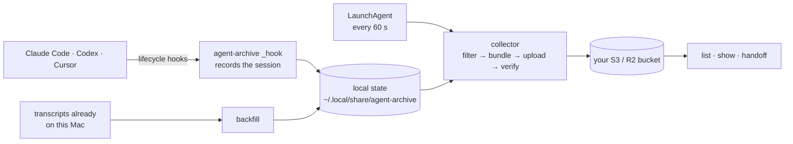

# agent-archive

[](https://github.com/wangjohn/agent-archive/actions/workflows/test.yml)
[](go.mod)
[](LICENSE)

A lightweight CLI that hooks into Claude Code, Codex, and Cursor sessions and stores them in cloud storage (S3 or R2).

OpenAI and Anthropic are constantly one-upping each other or the best model, but it's a pain to switch between their coding agents. Every time you switch, you lose your history, and then don't have a single source of truth for where all your sessions live. Also, if you run out of limits in the middle of a session, it's very annoying to have to figure out how to hand that session over to the other coding agent.

`agent-archive` solves these problems, and can perform the following:

- Automatically upload Claude Code, Codex, and Cursor transcripts into a cloud object storage like S3 or R2.
- Hand off a local session from one computer to another with `agent-archive handoff`. When working locally across multiple computers, agent-archive makes it very easy to continue sessions and to keep a single source of truth for all of your sessions.
- Hand off a session from one coding agent to another (also using `agent-archive handoff`). Useful especially if you run into rate limits halfway through a session.
- View all of your past sessions across coding agents with `agent-archive list`. This allows you to set up automations to understand how you're using your agents, how different coding agents perform across different tasks, and can help you perform meta-improvements on your AGENTS.md and lint rules that span across Claude Code, Codex, and Cursor.

## Quickstart

1. **Install** on macOS:

   ```sh
   curl -fsSL https://raw.githubusercontent.com/wangjohn/agent-archive/v0.1.1/install.sh | AGENT_ARCHIVE_VERSION=v0.1.1 sh
   ```

2. **Create a private bucket** and an access key for it ([R2 and S3 steps](docs/getting-started/bucket.md)).

3. **Run setup** inside a project you want to include, or choose projects when prompted ([setup guide](docs/getting-started/setup.md)):

   ```sh
   agent-archive setup
   ```

That's it -- as soon as you start a new session after setup, it will get sent into object storage and you'll be able to see it. You can verify status by running `agent-archive status` and take a look at past sessions that have been archived with `agent-archive list`.

To add a second Mac, install and run setup there with the same bucket (see [multiple Macs](docs/guides/multiple-macs.md)).

## How it works


```mermaid
flowchart LR
  A["Claude Code · Codex · Cursor"] -- "lifecycle hooks" --> H["agent-archive _hook<br/>records the session"]
  H --> S[("local state<br/>~/.local/share/agent-archive")]
  L["LaunchAgent<br/>every 60 s"] --> C["collector<br/>filter → bundle → upload → verify"]
  S --> C
  C --> B[("your S3 / R2 bucket")]
  B --> R["list · show · handoff"]
  T["transcripts already<br/>on this Mac"] --> BF["backfill"] --> S
```

Setup edits each included app's hook settings and adds one LaunchAgent; for Cursor it also adds a missing `version` field ([everything it changes](docs/getting-started/setup.md#what-setup-changes-on-your-mac)). Old sessions are deleted from the bucket after 90 days by default.

## Commands and docs

| Command | What it does | Example |
| --- | --- | --- |
| `setup` | Configure apps, projects, and storage. | `agent-archive setup` |
| `status` | Check capture health and see what to do next; `status claude` shows one app in full. | `agent-archive status` |
| `sync` | Collect and upload pending sessions now. | `agent-archive sync` |
| `list` | Find archived sessions. | `agent-archive list --since 7d` |
| `show` | View a session's summary, or its transcript with `--transcript`. | `agent-archive show SESSION_ID` |
| `stats` | See your usage: tokens by day, estimated cost, agents, models, projects, highlights. | `agent-archive stats --days 7` |
| `backfill` | Preview sessions already on this Mac for import. | `agent-archive backfill --dry-run` |
| `handoff` | Turn your latest session into a prompt for another agent, or launch a local agent with it. | `agent-archive handoff --latest --to codex` |

Use a session ID from `list` with `show`. For every command and option, see the **[full CLI reference](docs/reference/cli.md)** or run `agent-archive help COMMAND`.

[Install](docs/getting-started/install.md) ·
[Setup](docs/getting-started/setup.md) ·
[Troubleshooting](docs/guides/troubleshooting.md) ·
[FAQ](docs/guides/faq.md) ·
[Privacy](docs/security/privacy.md) ·
[All docs](docs/README.md)

## Contributing and security

See [CONTRIBUTING.md](CONTRIBUTING.md); test without touching your real Mac ([sandbox recipe](dev/contributing/testing.md)). Report vulnerabilities privately as [SECURITY.md](SECURITY.md) describes. Changes are in [CHANGELOG.md](CHANGELOG.md). Released under the [MIT License](LICENSE).
