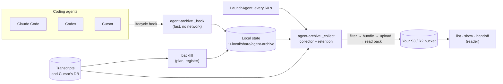
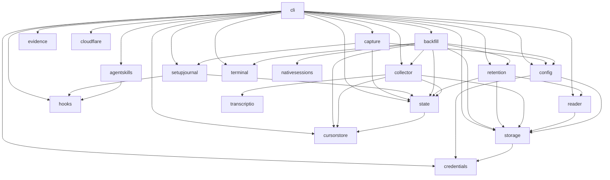

# Architecture

agent-archive is one Go binary, `cmd/agent-archive`, with everything else in
`internal/`. The design rationale is in the [archive design](../specs/archive.md);
this page is the map.

## The paths through it

1. **Hook** (`internal/capture`, run by `_hook`). An app runs `agent-archive _hook
   --harness <app>` at session start, stop, and similar events. The hook checks the
   configuration, records the session (`registrations/`) or queues work
   (`requests/`) under `hooks.lock`, and returns within milliseconds. It does
   no filtering or uploading, never touches the network, and never writes to
   stdout. The `_hook` command in `internal/cli` is only the adapter: it
   parses `--harness`, decodes stdin, and always exits 0, recovering a panic
   into a diagnostic.
2. **Collector** (`internal/collector`, run by `_collect` or `sync`). Under
   `collector.lock`, for each registered session it reads the transcript,
   filters it through the app's adapter, builds a source bundle, derives
   metadata, and publishes source then metadata, verifying the source in
   storage (its SHA-256 and size, or a read-back where the service reports
   no checksum) before the metadata points at it. Retention runs after each
   pass.
3. **Reader** (`internal/reader`). `list`, `show`, and `handoff` read the
   bucket: metadata first, and a source only when asked, verified against
   the metadata's checksum.
4. **Backfill** (`internal/backfill`). Plans an import of existing
   transcripts read-only, then registers the confirmed sessions in short holds
   of `hooks.lock`; the collector uploads them like any other.

## Packages

| Package | Owns |
| --- | --- |
| `agentmeta` | Standard-library-only canonical identities, aliases and immutable catalogs; unknown archive names remain representable. |
| `agentapi` | Narrow launch and runtime ports. Native argv and environment observations are pure; shared CLI owns executable resolution, selection policy, environment cleanup, file lifetime and execution. |
| `agents/claude`, `agents/codex`, `agents/cursor` | Native executable preferences, argv rules, exact-session or project-presence detection and explicit session environment cleanup keys. Cleanup keys do not imply runtime presence. |
| `agents/builtin` | Immutable production operation bindings and precomputed runtime/cleanup projections; composition does no filesystem, version or executable probing. CLI composition injects narrow lookups into real consumers. |
| `testutil/agenttest` | Launch and runtime conformance suites called by each native integration's tests. |
| `archive` | The privacy filter and adapters (one per app), source bundles, metadata derivation, the normalized view, and handoff rendering. No filesystem, network, or CLI dependencies, so it is fully testable on fixtures. |
| `nativesessions` | Read-only Claude/Codex layouts, bounded identity discovery, checkout scoping, coverage and deterministic modification-time catalog ordering. No config, state, storage, collector or CLI dependency. |
| `transcriptio` | Verified regular-file snapshots, captured read boundaries and complete-record bounded head/tail windows. No native discovery or archive policy. |
| `collector` | The scan, build, publish loop; change detection; subagent capture. |
| `state` | Per-session local state: registrations, requests, published and pending publications, change detection, removal records, and the per-session locks (`Store`; see [local state](../../docs/reference/local-state.md)). `state/statetest` has test helpers. |
| `retention` | Deleting superseded snapshots and expired sessions, with the remote metadata as the source of truth. |
| `storage` | The object-store contract and the S3/R2 implementation; checksums, read-back, bucket privacy inspection, and `Diagnose`, which names a storage failure's cause in plain words. Keys are relative to the configured prefix. `storage/storagetest` has the in-memory store tests use. |
| `cloudflare` | Cloudflare's management API, only what guided R2 setup needs: list accounts, create a bucket, create and revoke a bucket-scoped API token, read public-access settings. Used at setup time with a pasted bootstrap token that is never stored; `cloudflare/cloudflaretest` is the fake tests use. |
| `credentials` | Resolving storage credentials: AWS profiles, and R2 secrets in the Keychain (cgo, Security.framework). |
| `config` | `config.json`: the one record of how this machine is set up. |
| `local` | The data directory, atomic durable writes, and file locks. |
| `platform` | The one place that knows the operating system: `platform.OS` (`Darwin`, `Linux`, and an `Unknown` that fails closed), `platform.Current` (the only non-test reader of `runtime.GOOS`, `TestOnlyPlatformReadsRuntimeGOOS`), and `Locations`, where the OS keeps Cursor's data, the desktop apps' folders, temporary directories, privacy-protected folders and the Cursor snapshot root. Pure: it runs no program and opens no file (the two inputs that need the system come in as `LocationDeps`), and imports no `credentials` or `hooks` (depguard and `TestPlatformImportBoundary`). |
| `hooks` | Checking, planning, installing, and removing the hook entries in the apps' hook files. |
| `scheduler` | The port to whatever runs the background collector: `Ref`, `Site`, `JobState` (the words `status` reports), the desired state of a job (`Installation`, `JobSpec`, and `Plan`, a pure rendering of a definition as file `Artifact`s), what a scheduler reports (`Status`, with the `Problem` facts and `Words` nouns the commands' messages are filled from), the `Scheduler` interface (`Definer`, `Inspector`, whose `Installed` lists an installation's own job and its aliases, and `Controller`), `Retiree`, the job setup retires, the `NotOwnedError` and `IndeterminateError` an `Unload` refuses with, and the `Runner` an adapter runs its tool through. Pure: it runs no program and imports no `credentials` or `hooks` (depguard and `TestSchedulerImportBoundary`). |
| `scheduler/launchd` | The macOS adapter: the LaunchAgent plist (planning it and reading its program, environment and data directory back), the collector's labels and every earlier one (`Installed`: the labels earlier releases gave the collector, and the prototype's upload job), and the `launchctl` calls that ask about, load and stop a job, all through the `Runner` it is given. |
| `scheduler/systemd` | The Linux adapter: the collector as two user unit files, a oneshot service and a timer (planning them and reading the program, environment and data directory back from the service), the unit names that are its refs, and the `systemctl --user` calls that ask about, load and stop a job, all through the `Runner` it is given. |
| `testutil/schedulertest` | Test helpers for the port: `Model`, a scheduler that is not launchd, and `RunConformance`, the suite every adapter passes over a fake `Runner`. |
| `scheduler/host` | Chooses the adapter for the system (launchd on macOS, systemd on Linux; on another system, a scheduler called `none` that says every job is unknown and refuses changes) or by the name `config.json` records (`background_backend`; `Lookup`), and owns the real `Runner`: the program in a process group of its own, output combined, with the variables that reach the user's systemd manager for `systemctl` and `loginctl`. Only `host` imports an adapter (depguard and `TestOnlyHostImportsAdapters`); running a program is limited to a listed set of packages (`TestOnlyListedPackagesRunPrograms`). |
| `agentskills` | The skills setup installs into Claude Code, Codex, and Cursor (`/handoff`): the `Registry`, each skill's text as an embedded template rendered per destination, and planning their install, removal, and refresh as setup-journal changes. A file is setup's by a marker line and this installation's data directory; `Stale` names the files an upgrade has outdated. |
| `capture` | The hook runtime: classifying a hook event, admitting a new session or continuing a registered one, lifecycle and final-response evidence, subagent links, and the content-free capture diagnostics status shows. It imports nothing from the command line, even transitively, and does not itself import anything that runs a program, opens the Keychain, or uses the network (`credentials` and `storage` come in only through `config`, for their types); depguard and `TestCaptureImportBoundary` enforce this. The one program a hook does run is `git`, for the repository key and the checked-out commit: `cli` passes in the lookups, which run before `hooks.lock` is taken, at the same time as each other, only for a new session in an archived project (and, for HEAD alone, at a stop of a registered one), and are abandoned after 600 ms. |
| `gitremote` | The only place the program runs `git`: reads a project's `origin` with a 500 ms timeout and returns `archive.RepoKey` of it, and reads the commit a working directory has checked out and whether its tree is dirty (`Head`, `Dirty`, `HeadState`; see [the commit a session started on](../specs/git-head.md)), each "" or nil on any failure. It runs git itself (one of the packages `TestOnlyListedPackagesRunPrograms` allows), behind its own injectable `Runner`, not a `scheduler.Runner`. `capture` may not run programs, so `cli` hands the hook these lookups (`capture.WithRepoKey`, `capture.WithGitHead`). |
| `setupjournal` | Setup's transaction (`setup-transaction.json`): writing the journal before any hook file or the LaunchAgent changes, rolling a failed setup back, recovering an interrupted one without overwriting later edits, and recording the prototype's job and the collectors installed under earlier labels that setup retires (which jobs those are is the scheduler's to say). A scheduler is reached only through the `Backends` its caller passes (cli's `Env`), which resolve the backend name each journal records, so every job is driven through the backend that made it. Every command and the hook check whether a journal is pending. |
| `evidence` | Skill inventories and snapshots, as privacy-filtered evidence. |
| `cursorstore` | Reading Cursor's `state.vscdb` without writing to it or beside it. |
| `backfill` | Import policy, the complete import plan, registration, and undo; Cursor discovery stays here. |
| `nativesessions` | Shared read-only Claude/Codex store layouts and identity/cwd header facts. No configured archive, collector, network, program, or UI dependencies. |
| `transcriptio` | Verified regular-file snapshots with private file identity and a fixed read boundary, context-aware reads, and complete JSONL boundaries. Discovered files can require store containment; explicit inputs keep symlink compatibility. No archive policy, network, program, or UI dependencies. |
| `reader` | Listing metadata and loading verified sources, with a disposable metadata cache. |
| `trace` | `AGENT_ARCHIVE_TRACE`'s recorder: process-wide, so `storage` (each request), `reader`, `state`, `collector` and `config` record spans without a context threaded through every command. Spans carry fixed names, durations and counts only. Standard library only. |
| `cli` | Every command: flags, prompts, rendering, and the wiring between packages. Terminal output takes its colors, symbols, wrapping, and spinner from `ui.go`, which prints plain text when output is not a terminal, `NO_COLOR` is set, or `TERM` is `dumb`. The `stats` screens are pure page functions (`renderPage` in `stats_render.go`: numbers and a view in, lines out) with one color table (`stats_colors.go`). Process state (args, stdio, the clock, the home directory, launchctl, the Keychain) reaches commands through an injectable `Env`. A few lower packages still read the process directly: `local` (`AGENT_ARCHIVE_HOME` and `$HOME`), `credentials` (AWS configuration files and the Keychain), and `cursorstore` (the user's temporary directory, through `getconf` on macOS). |
| `statsfmt` | How `stats` writes a number: token counts (`4.9M`), money, percentages, ordinals. Shared by the terminal screen and the page so one number reads the same on both; pure, imports only `archive` (depguard and `TestFormattersImportBoundary`). |
| `statshtml` | Renders the engine's `stats.Stats` as one self-contained HTML page for `stats --html`: an embedded `html/template` and stylesheet, inline SVG charts (daily bars, a token-composition donut), no script and no external request, valid as strict XML, light, dark, print and forced-colors. Pure: it imports only `stats` and `archive` (depguard and `TestRendererImportBoundary`), reads no clock, and every name reaches the page as a `string` that `archive.DisplayLine` has cleaned and the template has escaped (`TestNothingIsMarkedTrusted` forbids the `template` types that skip escaping). Project, skill and MCP server names are replaced by "project A", "skill A", "MCP server A" unless asked for. |
| `stats` | The numbers behind `stats`: tokens, sessions, estimated cost, agents, models, projects and highlights over a window of days, computed from session metadata by one pure function (`Compute`). It takes the metadata, the time, the time zone and a price table as arguments, so it reads no clock, file, environment or network and imports only `archive`'s types (depguard and `TestStatsImportBoundary` enforce this). Cost comes from a dated, versioned price table embedded in the package (`prices.json`) that a person's own JSON file can override; a model the table does not list is left unpriced, never guessed. |
| `doclinks` | A test that the documentation's relative links resolve. |

## Package dependencies

Arrows point at what a package imports; `local` and `archive`, which nearly
everything imports, are left out. Only `cmd/agent-archive` imports `cli`; `capture` and
`setupjournal` never import `cli`, `terminal`, or `golang.org/x/term`
(depguard in `.golangci.yml`, and a test in each package).

## Invariants worth knowing before you change anything

- Nothing leaves the machine except what an adapter's filter kept. Unknown keys
  are dropped and named, never passed through. See
  [privacy](../../docs/security/privacy.md) and [versions](../maintainers/versions.md).
- The bucket's `metadata.json` is the live pointer. A source is uploaded
  before the metadata that points at it, and deleted only after it is no
  longer pointed at.
- Pending publication bytes are frozen before the first remote write, so a
  retry uploads byte-identical objects.
- Local writes are atomic and durable (temporary file, fsync, rename,
  directory fsync). One unreadable state file is quarantined, not fatal.
- Hooks must be fast and silent: an app waits for them. `capture` waits at
  most a second for `hooks.lock` and 50 ms for `diagnostics.lock`, and the
  `_hook` command exits 0 whatever happens.
- Every side effect in `cli` goes through `Env`, so tests never touch the real
  home, launchd, Keychain, or a bucket.
