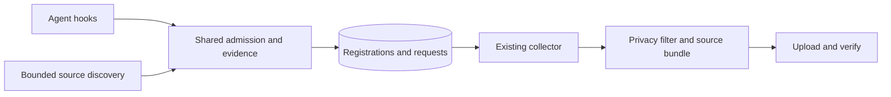

# Local session discovery: engineering proposal

> **Proposed; revised source contract.** Not implemented on the default branch. See the [documentation index](../../docs/README.md) for what exists today.

Status: proposed plan for review. Prepared 2026-10-01; source and Codex scope contract revised 2026-10-03. This proposal adds automatic discovery of new local Codex sessions to the background collector, with shared admission rules that can support other agents later. This document describes the intended behavior, not a claim that automatic discovery is available. Implementation work is tracked separately; it does not change this machine's capture configuration.

## Purpose

Make capture work after agent-archive setup for people who use the Codex desktop app and never open the Codex CLI to approve hooks. Keep hooks as a complementary source of timely lifecycle evidence. Give both paths one session identity, one admission decision, and the existing privacy-filtered publication pipeline.

The initial release supports Codex only. The discovery contract and state transitions must be agent independent; Claude Code and Cursor continue using their existing hooks until separately evaluated.

## Problem and current behavior

The collector already runs in the background, but normally processes sessions that hooks or explicit backfill have registered. Installing a hook does not establish that the agent has approved or executed it. A working background job therefore does not guarantee that new Codex sessions enter the archive.

| Observation | What it establishes | What it does not establish |
| --- | --- | --- |
| `hooks installed` | Hook definitions are present. | Codex trusts them or has run them. |
| `no sessions yet` | No eligible live registration has been observed. | Hook approval was denied; the user may have no eligible fresh session. |
| An imported session | Backfill can read at least that source. | Hooks work or automatic discovery works. |
| Background collector on | The scheduler is configured; scan timestamps provide separate liveness evidence. | Discovery or upload succeeded for this agent. |
| A desktop worktree outside an included directory | Its checkout path is outside the direct project rule. | Its main repository is excluded; Git worktree metadata may map it to an included repository. |

OpenAI documents trust review for non-managed hooks and the `/hooks` review flow in the CLI. The desktop slash-command reference does not list `/hooks`; that omission is not proof that every desktop version lacks a hook interface. Setup should not depend on users finding an undocumented desktop approval prompt. Sources checked 2026-10-01: [hooks](https://learn.chatgpt.com/docs/hooks), [slash commands](https://learn.chatgpt.com/docs/reference/slash-commands).

Relevant existing code:

- [Collector](../../internal/collector/collector.go) processes registered sources and replays pending admission intents.
- [Codex backfill discovery](../../internal/backfill/discover.go) locates rollout files and reads bounded headers.
- [Project resolution](../../internal/backfill/resolve.go) handles configured projects and Git worktrees.
- [Hook admission](../../internal/capture/hook.go) owns fresh-start admission and lifecycle evidence.
- [Session admission guide](../contributing/session-admission.md) distinguishes native start time from archive admission time.

## Scope

**Included:** new, eligible local Codex sessions; desktop and CLI validation; worktree resolution; hooks and discovery cooperating; explicit Codex-only included-projects or all-projects consent; bounded discovery; accurate status; compatibility with existing registrations, backfill, pause, retention, and destination changes.

**Deferred:** automatic discovery for Claude Code or Cursor, cloud retrieval, a new GUI onboarding application, filesystem watchers, runtime plugins, retroactive imports, and changes to the transcript privacy filter. Cloud capture remains a [separate proposal](cloud-capture.md).

“Local” means a supported session record read from a default or explicitly configured Codex home on this computer. It does not mean proven execution on this computer. The adapter validates source format, native identity, start time, and available import/fork/remote classifications. Identifiable unsupported histories remain available through deliberate backfill rather than automatic admission.

A recently copied or downloaded session whose supported metadata is indistinguishable from an ordinary record is eligible if it satisfies every other admission rule. Its original native start must fall within capture consent; copying old history never makes it fresh. This is an explicit source-trust boundary, not a cryptographic provenance promise. The user accepts this limitation; its frequency has not been measured. See the [bounded source investigation and decision](local-session-discovery-evidence.md).

## Principles and decisions

| Decision | Reason |
| --- | --- |
| Discovery runs in the existing background collector job. | One scheduler, retry mechanism, and upload pipeline. |
| Hooks remain useful but optional for automatic Codex admission. | They provide prompt/stop/end evidence and faster requests; discovery removes approval as an onboarding dependency. |
| Add a small compile-time adapter registry. | New agents supply source discovery and start evidence without duplicating policy. No dynamic plugin framework is needed. |
| Existing installations explicitly enable discovery through setup. | An upgrade must not silently broaden capture behavior. |
| Fresh interactive setup offers discovery and defaults scope to included projects; scripts explicitly choose ingress and new scope. | Selecting Codex or accepting defaults must never silently grant all-projects consent. |
| Codex capture scope is separate from discovery ingress. | One explicit all-projects approval covers current and future Codex projects, including approved hook-only capture when discovery is off. |
| Native start evidence governs discovery eligibility; admission time keeps its existing meaning. | Scan time cannot make an old session eligible. |
| Missing or invalid required metadata and identifiable unsupported classifications fail closed and are visible. | Preserve admission boundaries without requiring an unavailable proof of local execution. |
| Indistinguishable recent copies use ordinary eligibility rules. | Approved source homes are the capture boundary; native start, project and destination consent still apply. |
| No extra publication path. | Preserve filtering, checksums, source-first publication, metadata-last publication, and read-back verification. |

## Design

### 1. Shared source discovery, separate policy

Extract reusable source enumeration, bounded header parsing, and project/worktree resolution from backfill into lower-level packages. Backfill keeps its plan, confirmation, historical-import policy, and undo behavior. Automatic discovery supplies a different admission policy over the same source facts.

The dependency direction is CLI orchestration → discovery/admission → source catalog and state. The collector continues to consume registrations. Do not make collector import backfill: backfill already uses collector filtering, and sharing its orchestration would create a dependency cycle or mix import policy with automatic admission.

An adapter returns candidates and typed outcomes. The contract contains:

| Field | Meaning |
| --- | --- |
| Agent and native session ID | Identity within this machine's agent namespace. |
| Source descriptor | Source kind, stable source key, and private locator. A locator can identify a file or database record; it is not necessarily a transcript path. |
| Native start and evidence kind | An adapter-supported native timestamp and format facts for a qualifying source record; not proof of local execution. |
| Working directory | Input to shared project authorization. |
| Parent/fork/execution classification | Available facts used to reject identifiable unsupported imported, inherited, or remote histories. |
| Source fingerprint | A scheduling hint for retry and change detection, never proof of freshness. |

Adapters cannot authorize a project, select a destination, or register a session. Shared policy does that. Outcomes distinguish incomplete metadata, unsupported format, invalid identity, unavailable source, and a usable candidate. The API supports bounded enumeration with a continuation token and cancellation; it does not return all candidates in one in-memory slice.

Codex enumeration starts with the locations already supported by backfill: default and explicitly configured Codex homes, active rollout files, and archived rollout files. Persist configured homes so a scheduled process does not depend on the shell's current `CODEX_HOME`. Do not recursively search the user's home directory. Active and archived copies of one native session are one candidate with a deterministic preferred source and fallback if it disappears.

### 2. Capture scope, ingress, and authorization lifetime

Persist one tagged Codex-only scope: `included-projects` (legacy default) or `all-projects`. Discovery-source enablement is a separate choice. All-projects means **all current and future Codex projects**, subject to explicit exceptions, approved source homes and destination; it never authorizes Claude Code or Cursor. Neither an empty project list nor a `/` sentinel grants blanket permission. Zero explicitly included projects is valid for Codex-only all-mode; other selected apps retain their existing project requirements. Do not crawl the filesystem for project content or create a permission record for each newly discovered project.

For an unknown native ID, discovery requires enabled ingress, committed valid scope/source/destination permission, supported bounded metadata, consistent native ID/source identity, absolute cwd, an eligible original native creation timestamp, an unpaused interval, and no winning exclusion or removal record. Identifiable unsupported imports, forks, child-session linkages and remote records reject; missing independent execution proof alone does not. Source classification and copy boundaries remain as above. Observation, copy, mtime and resume times never substitute for creation. Fresh hooks share scope policy while retaining their established provable fresh-start evidence; delayed hook intents retain their original observation and evidence. Backfill remains deliberate historical import.

All-mode uses one blanket generation bound to a destination and bounded half-open unpaused intervals (`start <= original start < end`). Intervals open only when permission commits. Explicit exception history and forward barriers are bounded by user-configured exceptions, not discovered-project count. Harmless display/skill edits and new projects never rotate consent or write configuration. Included mode retains configured-project authorization and legacy ownership; its earliest new-discovery start is the latest of project activation, source enablement and destination activation. Setup and pause/resume atomically persist permission and interval changes, including crash recovery. Keep start checks in shared admission helpers; continuation still uses immutable admission/destination under the admission guide, rather than treating a resume as a new grant.

| Transition | Required behavior |
| --- | --- |
| Included → all | Open a fresh blanket new-admission window; preserve existing native-ID ownership. |
| All → included | Stop collection outside remaining scope without implicitly deleting published data. |
| All disabled then re-enabled | Open a fresh unknown-session window; retain prior attribution of admitted IDs. |
| Pause/resume | Stop capture/publication as today; resume eligible existing registrations. Never newly admit starts during paused intervals; earlier unpaused intervals remain usable only in the current generation. |
| Discovery off/on | Stop new discovery ingress without erasing Codex scope or legitimate registered history. Approved hooks retain their source behavior; re-enabling opens a fresh discovery-ingress window for unknown IDs rather than admitting earlier or disabled-period starts. |
| Agent removal or current exclusion | Continue to govern collection, including existing registrations. |
| Destination change or return | Never migrate prior registrations. Returning preserves existing destination ownership but opens a fresh window for unknown starts. |
| Pairing to another machine | Transfer useful settings, not live authorization intervals; that machine reviews and commits its own permission. |

Clock anomalies have content-free outcomes: reject implausible future timestamps and fix/test supported skew before release. Bounded history compaction fails closed for expired or unprovable starts. These timestamps and intervals are local evidence, not cryptographic provenance.

### 3. Physical identity, explicit rules, and worktrees

Separate physical project identity from permission. For newly admitted all-mode Git sessions, use the actual canonical repository root; validated worktrees map to their main repository while retaining actual cwd. Non-Git sessions use canonical cwd. A broad configured parent must not collapse newly discovered unrelated repositories into one project. Selected mode retains legacy configured-owner attribution. Known native IDs retain historical stored ownership across switches: validate source/cwd compatibility rather than silently moving them.

Resolve symlinks consistently and use shared resolution facts for automatic admission and backfill without changing import policy. The most-specific explicit inclusion or exclusion settles an exception, including intentional child inclusions below excluded parents. The blanket default never overrides a winning explicit exclusion. Evaluate checkout and mapped-main rules consistently; a winning checkout exclusion cannot be bypassed by worktree mapping. Unknown, missing or invalid worktree mapping defers or rejects with a diagnostic. Equal remote URLs and placement below `~/.codex/worktrees` never authorize a project. Bound Git metadata reads, traversal and cycles outside admission locks; never guess a deleted checkout's project from its filename.

Lifting an exclusion records a forward-only barrier for that subtree: unknown sessions begun while excluded remain ineligible after lifting it. An intentional child re-enable has its own applicable barrier. Unrelated projects keep their earlier blanket interval. Do not reset global consent on every exception edit.

### 4. One identity and atomic admission

The native-session index already uses agent-qualified `agentmeta.SessionKey` identities and supports legacy migration, reservations, conflict detection, and bounded recovery. Extend those existing APIs for discovery; do not add a parallel index or replace recovery with a discovery-specific migration. Preserve archive IDs, qualified child reservations, and the existing registration census used for recovery. Legacy mappings must still be accepted only after matching agent and native ID; ambiguous or corrupt mappings require repair rather than an overwrite or second upload. Removal-record lookups must remain effective.

Introduce a shared register-or-merge operation used by discovery, hooks, pending hook-intent replay, and backfill. The current `RegisterNewSession` operation is not sufficient as an insert-if-absent primitive: it can rewrite a registration. The shared operation must re-read state and configuration under the existing admission serialization and either:

- Create a fresh registration, allocate its archive ID, preserve the authorized destination, and queue collection durably.
- Return the existing compatible registration, merging only allowed source and evidence updates.
- Reject an identity conflict, tombstone, stale authorization generation, or incompatible project/destination.

Immutable fields include archive ID, original start, original admission, origin, destination, import attribution, and newly granted admission proof. A discovery registration has `origin: discovery`; an imported registration remains imported when hooks subsequently fire. Source replacement requires matching identity and project evidence, not just a shared filename. If a crash separates registration from its first request, the next pass must still collect the registration; index and registration writes must have a defined recovery order.

Newly authorized hook/discovery registrations record immutable scope admission proof. Publication and continuation for unlisted all-mode projects must recognize that proof and current policy; never broadly accept every Codex registration. Imports and legacy registrations never acquire blanket proof on resume.

All admission paths use the same lock order. Enumerate sources, read headers, resolve worktrees, and compute repository keys outside `hooks.lock`. Under the lock reload config and revalidate scope/rule revision, destination, original start/evidence, pause, removals and identity. Deferred fresh hook intents and scanner retries carry and revalidate the relevant policy token. Hold the admission lock only for bounded revalidation and local writes, one candidate at a time. Yield between candidates and skip contended lock acquisition; retain the candidate for retry. Never hold that lock while parsing a full transcript or accessing storage.

### 5. Hooks and discovery cooperating

| Arrival order | Required result |
| --- | --- |
| Hook, then discovery | One registration; discovery can repair a missing source locator without changing origin or destination. |
| Discovery, then hook | One registration; hook evidence is added without resetting admission or changing discovery origin. |
| Concurrent hook and discovery | The atomic operation chooses one creation; the other merges or returns it. |
| Backfill, then either path | Preserve import attribution and admission rules; do not relabel the session as a fresh automatic capture. |
| Removal, then discovery | Honor retention/undo removal records; no resurrection. |

Track hook observation separately from origin. A later prompt, stop, or other supported hook on a discovery registration can establish hook observation even if its start hook never ran. The evidence must be durable and independent of whether an upload succeeds. Legacy hook registrations keep their current interpretation; imported registrations alone do not prove hooks work.

Discovery cannot manufacture stop/end events, final-response evidence, or proof of transcript completeness. Existing parser-derived timestamps and available subagent links remain usable, with gaps reported honestly. Emit discovery provenance and a specific missing-hook-evidence gap where appropriate; do not reuse an import-only gap or make `ImportedAt` appear on a discovery session. Later hook observation does not retroactively prove earlier lifecycle coverage. Automatic discovery admission of child sessions is unsupported in the first release, even when their parent is admitted. Preserve existing hook-driven child capture and parser-derived linkage. Future automatic child support requires an admitted parent, validated linkage, and a separately reviewed safe content boundary. Hooks continue to improve timeliness and evidence when approved.

### 6. Collector orchestration, budgets, and recovery

Run discovery as a bounded stage of the existing collector job, before processing the registrations it admits. Preserve collector serialization, configuration reloads, pending-intent recovery, cancellation, and shutdown handling. Registration is local work: a storage outage must not prevent eligible sessions from being registered and later uploaded. Separate storage initialization failure from discovery failure in the orchestration and status.

Retain the scanner baseline: five-second source observation and at most 256 header probes per scheduled pass, 8,192 metadata cache entries, 4,096 directory cursors, 256 retained retries and fair at-most-64 retry revisits, with cancellation between candidates. These bound source work, not the whole collector or identity census. Reuse bounded header reads, cap directory entries processed per batch, and measure the resulting I/O and memory. Discovery must leave time for already queued captures, verification, and retention. Large backlogs continue fairly across passes rather than repeatedly selecting the same first files.

Use a private, bounded catalog of source fingerprints, cached metadata, retry outcomes, and durable continuation. Revisit partial files after changes or bounded retry delays. Fingerprints detect ordinary replacement/truncation; periodic bounded header revalidation handles replacements that retain the same size and timestamps. Reconciliation also handles moves to archived storage, directory changes, and stale caches. Neither mtime, a dated filename, nor an enumeration cursor establishes fresh-start eligibility. If a cursor is invalidated, reconciliation must restore coverage without silently skipping files.

The common case should avoid rereading unchanged historic headers and never fully parse an unregistered ineligible transcript. Known eligible registrations continue through existing change detection and filtering; discovery must not enqueue an urgent request on every scan. Bound and prune cache records, preserving removal records according to existing retention semantics. A failed or interrupted pass must not record unfinished reconciliation as successful.

Classify errors per root and candidate. A missing optional source root differs from an unreadable configured root. State write failures must be retried, not recorded as a permanent candidate rejection. Persist last attempt, last completed reconciliation, pending work, and sanitized error categories. Do not count a discovery-root error as a failed archived session or let it conceal successful collection for another agent.

Persist an atomically written, versioned, content-free health summary bounded to 16 KiB. Basic discovery status reads that summary rather than the full catalog. Missing, stale or corrupt health reports uncertainty and last-good evidence. Proposed discovery-specific reads target <10 ms p95 warm / <50 ms p95 cold, with zero source/Git/SQLite/storage reads; this is not a full-status timing claim.

Resolve explicit rules once per policy snapshot and bound per-pass cwd/Git caches with validated invalidation. Retain 64 ancestor depth and 4 KiB Git metadata caps; aggregate 1,024 metadata/stat operations and 256 KiB Git reads per pass are proposed targets requiring measurement. Budget exhaustion defers with a reason, never broader permission. Measure complete census/publication before replacing it: partial census never certifies absence. Proposed recovery targets are 64 MiB bounded working state and progress-preserving roughly five-second slices, with existing publication progress. Gate failure owns conditional S or blocks activation; do not relabel unmeasured targets as passed.

### 7. Security and privacy

Discovery reads agent-owned sources with the current user's existing filesystem permissions. It adds no credential, executes no hook definition, and never modifies Codex hook trust. User consent is agent-archive's capture setup, including selected Codex scope, exceptions, source homes and destination. Hook approval remains a separate Codex decision.

Before project authorization, inspect only bounded metadata needed for identity, start, execution classification, and working directory. Keep those facts in private local state; they can themselves reveal project paths. After authorization, use the existing transcript filter and publication pipeline. Raw transcript content must not appear in the catalog, logs, diagnostics, or temporary discovery files. Diagnostic/performance summaries omit transcript bodies, native IDs and discovered project/path samples.

Treat file content and locators as untrusted input: allow expected regular sources, reject devices/FIFOs and path escapes, bound records and traversal, and revalidate identity when the source is reopened for collection. Explicitly configured symlinked Codex homes may be resolved to approved source roots; per-file symlinks must not permit reads outside those roots. Apply equivalent limits to worktree metadata. Sanitize OS errors before display because they often contain paths and native IDs.

The feature's guarantee is scoped to approved local source homes and the current user's trust boundary. It neither proves where a task executed nor prevents that user or a process with the same permissions from fabricating a transcript. An indistinguishable recent copy can be uploaded under the same consent rules as an ordinary record. Protect against historical capture, malicious source contents, and unintended path traversal without claiming tamper-proof provenance.

### 8. Setup and status

Fresh interactive setup defaults to included-projects and lets users explicitly choose “All current and future Codex projects.” Establish authorization only when setup commits; preserve rollback and interrupted-transaction recovery. Unsupported formats require actionable guidance rather than a ready claim. Existing installations explicitly opt into discovery and any scope expansion; enabling either is forward-looking and never auto-runs backfill.

The proposed public script flags are `--codex-discovery on|off` and `--codex-capture-scope included-projects|all-projects`. Fresh scripted Codex setup requires both flags explicitly, choosing discovery on/off and scope included/all; missing either fails before mutation. Reconfiguration with omitted choices preserves recorded consent; any new scope grant requires an explicit scope choice. Invalid/no-Codex combinations fail before mutation. `--apps codex`, `--yes`, a new destination, refresh, pairing and defaults never imply all-mode. All-mode plus discovery-off is a meaningful approved hook-only choice. Use these names consistently in implementation/help/tests.

The activation PR owns five UX changes:

1. Lead Codex's basic status row with discovery state and scope; hooks are secondary. Absent optional hooks are distinct from broken owned hooks and foreign installation warnings. Capture, upload, readback and actual hook observation require separate evidence.
2. Show no task yet, supported observations, skipped unsupported/malformed records, source unavailable and mixed results in ordinary status, with bounded counts/reasons even when some tasks succeed. Suggest updating agent-archive or a supported fallback without promising hooks/backfill understand unknown formats or diagnosing desktop compatibility from the shell CLI version alone.
3. Show last attempt age and pending phase: discovery/reconciliation, identity recovery or upload queue. Manual sync advances bounded work, not exhaustive coverage. Show registered → queued → published → verified evidence, without fabricated percentages/ETA. Normal progress is not a repair warning; large cold coverage limits remain explicit.
4. Require the explicit scripted discovery/scope consent above, including retained choices and errors before mutation.
5. Review short separate rows for Codex-only scope, capture mechanism, exceptions, approved source homes, destination, original-start boundary/history and optional hooks. Show scope expansion/reduction and affected forward boundary before commit; display actual local consent paths/destination only in that review. Add one concise line: “Qualifying recent native copies may be captured.” Use existing CLI fixtures, not a new dashboard.

Success guidance follows the chosen scope: start a supported new Codex task in an included project, or any non-excluded current/new project under explicitly approved all-mode. Healthy warm isolated capture normally registers within two scheduled stages after identity recovery and within load budgets; scan, upload and verification remain separate. Optional hook review supplies additional lifecycle evidence through the documented CLI path.

Keep overall capture, discovery health, hook observation, and storage verification distinct in machine-readable status. Preserve existing JSON fields where their meanings remain valid; version incompatible semantic changes. In particular, `HookObserved` must no longer be inferred from every non-import registration. Status must never claim complete source coverage merely because the scheduled job ran.

## Compatibility and schema work

- Legacy/v2 configurations migrate to included-projects without widening scope. Blanket scope/proof require an incompatible recognized writer fence, provisionally config version 3 / `codex-scope-v3`; final wire names need implementation review. Optional fields under discovery-v2 are unsafe because older v2 readers ignore them.
- Old main/v2 writers must refuse active and disabled/history-bearing blanket state before mutation. Every save/marker helper preserves the strongest fence: setup drafts, journal Before snapshots, pairing, pause, skill policy, backfill and recovery. Removing authorization fields must never downgrade the fence. Test refusal without changing any files.
- Existing registrations and archive IDs remain stable. Empty origin remains legacy hook origin. Existing imports, publication requests, and removal records retain their meanings.
- Add discovery origin to relevant registration, source, metadata, and JSON schema definitions where those fields are emitted. Audit every `!Imported()` branch: automatic capture does not imply hook execution.
- Update parser/filter/adapter or schema versions only according to the actual output changes and the [version rules](../maintainers/versions.md). Do not assume that an optional origin enum extension is understood by every older reader.
- Update the admission guide, adding-an-adapter guide, architecture, setup/help, status reference, and privacy documentation when the feature is implemented. This proposal makes no changes to current user documentation.

## Phases and work packages

| Phase | Work | Exit condition |
| --- | --- | --- |
| 0. Bound source investigation | Inspect pinned producer formats and disposable execution/import/copy probes; record actual desktop versus CLI coverage. | Document supported metadata, identifiable rejection cases, and the indistinguishable-copy limitation. Missing execution provenance alone does not block discovery. |
| 1. Shared foundations | Extract source catalog/resolver; preserve and extend qualified identity, reservations, and recovery; add shared atomic admission and durable authorization intervals with rollback compatibility. | Existing hook/backfill behavior passes; races, pause, exclusions, destination changes, and tombstones covered. |
| 2. Codex discovery | Add adapter, bounded incremental scan, retry/reconciliation, and local admission independent of storage availability. | Correct capture with hooks absent or unapproved; no duplicate uploads; measured resource budgets. |
| 3. Onboarding and status | Transactional enablement, existing-install opt-in, capture verification, separate discovery/hook health, docs and schemas. | Desktop user can enable capture and verify a new task without opening Codex CLI. |
| 4. Release acceptance | Disposable machine and bucket acceptance, upgrade/rollback checks, failure injection, and benchmark evidence. | All correctness/security gates pass; remaining fidelity limitations are explicit. |

Package boundaries are targets, not a line-count estimate. Use the following PR boundaries and integration order, preserving newer default-branch session identity and lifecycle behavior:

| PR | Scope | Dependency and activation |
| --- | --- | --- |
| Merged #304 and new contract follow-up | #304 delivered source evidence; a new documentation PR adds explicit blanket scope and revised consent. | Follow-up against main; fresh independent documentation review. |
| #305 Shared foundations | Keep published implementation unchanged; reusable identity/admission/config primitives. | Against main; change only for independently demonstrated defects. |
| #306 Codex scanner | Keep bounded scanning, fair retries and validated census absence baseline unchanged. | Against `codex/local-discovery-foundations` until #305 merges, then main. |
| New P. Blanket Codex policy/integration | Tagged scope/fence, shared resolver, hook/discovery admission/replay/proof, publication acceptance, lifetimes/exceptions, content-free health and scale evidence. | Against `codex/local-discovery-scanner` until #306 merges, then main. No public all-mode switch until consumers work. |
| New U. Activation and UX | Port task-only saved activation work; scope selection, all five UX changes, setup/drafts/pairing/refresh/help/docs/tests and native smoke. | Against P until it merges, then main. Retain private activation backup; never publish included-only activation first. |
| Conditional S. Measured scalability fixes | Narrow demonstrated resolver/census/publication/status bottlenecks, preserving qualified authority and complete-absence proof. | Create only when measured gates fail; stack on P before U and retarget U to S. |

The original five work packages remain contract, foundations, scanner, policy and activation. Since #304 merged before this amendment, a new contract follow-up precedes remaining integration: contract follow-up → #305 → #306 → P → U. Counting merged #304, this is six PRs total; insert S between P and U only when evidence requires it (seven total). Actual dependency branches, not PR numbers, are bases. Reconcile ancestry/retarget and refresh checks after prerequisites merge. No merge authorization is implied by this proposal. Keep activation behind policy consumers, real desktop, storage, compatibility and performance acceptance. Recent-copy ambiguity alone does not block activation; unavailable desktop acceptance does. Future agents require separately approved scope and source-specific probes.

| Area | Implementation ownership |
| --- | --- |
| Source facts and resolution | Extract from `internal/backfill/discover.go` and `resolve.go` into reusable lower-level packages; keep historical import policy in backfill. |
| Admission and identity | Shared policy below CLI; `internal/state` retains its qualified identity, reservation, migration, census/recovery, and removal-record APIs; shared admission extends atomic registration without replacing them. `internal/capture` retains hook interpretation and evidence. |
| Configuration lifecycle | `internal/config`, setup journal, and CLI setup/pause/resume persist and validate authorization generations. |
| Scheduled work | CLI collector orchestration invokes discovery; `internal/collector` continues filtering and publishing registrations. |
| Provenance and UX | Archive types/parser, JSON schemas, CLI status/setup, and contributor/user docs change together. |

## Review findings incorporated

The review strengthened the initial idea of scanning Codex files on each collector pass:

| Concern | Design change |
| --- | --- |
| A scan can make old history look newly admitted. | Require supported native start evidence within the current authorization generation and unpaused intervals. |
| Hooks, backfill, and discovery can race or overwrite provenance. | Share atomic register-or-merge, namespaced identities, and explicit immutable fields. |
| A naïve full scan grows with years of history and competes with hooks. | Budget enumeration/header work, persist fair continuation, reconcile caches, and keep discovery I/O outside admission locks. |
| Desktop users cannot tell whether capture actually works. | Offer supported discovery with explicit fresh-script consent and scope, with independent registration, publication verification, and hook-observation states. |
| New files may contain copied, forked, or remote history. | Reject identifiable unsupported cases and pre-consent native starts. Accept indistinguishable qualifying recent copies and disclose the source-trust limitation. |
| Upgrades can broaden capture or destroy eligibility history on rollback. | Require existing-install opt-in and a tested writer/schema compatibility policy. |

## Acceptance criteria

### Correctness and security

- With hooks absent or unapproved, a supported new desktop or CLI Codex task in an authorized included or all-mode project is discovered, filtered, published, and read back successfully.
- Old sessions, resumed old sessions, unknown sessions begun outside effective scope/source permission or during pause/exclusion intervals, excluded projects, and identifiable unsupported imported/inherited/remote histories are not automatically admitted. Invalid or missing start evidence never falls back to file timestamps.
- A supported recent copy without a reliable distinguishing classification follows ordinary admission rules. Tests cover rejection of a pre-consent copy, deduplication of an already registered copy, and eligibility of an otherwise qualifying recent copy; no test claims proof of local execution.
- External worktrees map to the included main repository only through validated metadata; explicit checkout exclusions win. Symlink escapes, cyclic/oversized Git metadata, FIFOs, malformed headers, and identity conflicts fail safely.
- Every ordering of hook, discovery, backfill, retry, and crash recovery yields one archive identity and preserves admission, origin, and destination. Different agents with the same native ID remain distinct.
- Retention and backfill-undo tombstones prevent resurrection. Destination switch and project reinclude do not cause historical capture into the new authorization period.
- Pause and setup races revalidate the current configuration before durable admission. A crash cannot leave partially granted discovery permissions.
- Raw content, source paths, and native IDs do not leak through routine diagnostics; all published content still passes the existing filter. Discovery adds no unfiltered upload channel.

### Performance and recovery

- Benchmark representative 1k/10k/100k source and registration counts, 1/100/1k/10k projects, Git/non-Git/worktrees, cold/warm and supported/unsupported/old mixes, bursts and unavailable storage/backlog. Repeat primary cases at least five times with provenance; report wall/CPU time, reads/stat/Git work, allocations and peak RSS separately, config writes/size, locks, stages and admission/upload/readback latency. This amendment adds no measurements.
- A warm idle scan performs no full transcript parsing; memory and per-pass discovery work remain bounded as history grows. Sustained arrivals and repeated interruptions do not starve archived directories or queued uploads.
- On the release acceptance machine, discovery holds the admission lock for a target p99 below 50 ms and causes no hook lock deadline failures under concurrent start/stop load. If that target fails, revise batching/locking before release.
- A supported isolated new task on a healthy warm catalog registers within two scheduled stages once identity recovery is complete and load is within budget; bursts exceeding probe limits have separate convergence tests. Cold-start/backlog status exposes delayed coverage; the benchmark establishes a documented convergence envelope rather than a false universal latency promise.
- Storage outages still allow durable local admission; subsequent recovery uploads once. Permission errors, cache corruption, moved files, truncated/replaced files, scheduler restart, and clock anomalies produce accurate recoverable outcomes.

### Onboarding and compatibility

- Once explicitly approved, all-mode admits supported starts in current and future unlisted Codex projects without per-project prompts or config writes; unrelated projects have separate identities and published/readback archives. Other agents never inherit this scope.
- Tests cover physical/legacy identity continuity, nearest explicit child overrides, subtree exclusion-lift barriers, all/included/off switches, pause, destination return, deferred replay/policy races, source moves, imports and current collection restrictions. Actual consumer tests prove filtering/publication/readback, not just predicate success.
- Script tests cover both required fresh discovery/scope flags and missing-flag rejection before mutation, explicit new-scope grants, retained omitted choices during reconfiguration, all-mode with zero projects/discovery off, invalid combinations before mutation, and pairing without transferred authorization.
- A desktop-only user completes agent-archive setup, starts a task, and sees verified capture without hook approval. The setup summary explains source homes, project scope, destination, existing-history exclusion, and the qualifying-recent-copy limitation.
- An upgrade does not enable discovery or import history silently. Existing hook-only installations and imports continue working.
- Status differentiates ready, found/pending, verified, degraded discovery, and unknown hook approval. An import or collector heartbeat does not falsely establish automatic-capture verification.
- Schema fixtures and migration tests cover legacy registrations, ambiguous indexes, old readers/binaries, and rollback behavior. Use disposable state and storage for all development acceptance; do not alter a developer's live archive configuration.

## Risks and open questions

| Question | Proposed resolution or release gate |
| --- | --- |
| Which Codex versions expose supported identity/start/classification metadata? | Phase 0 documents pinned formats and actual probe coverage. Do not default-enable unsupported formats or infer execution location from source presence. |
| Can a recent copy look identical to a session executed here? | Yes for the metadata tested. Accept otherwise qualifying records, disclose the limitation, and preserve native-start consent. Further useful classifications can be added without claiming universal detection. |
| Can inherited records precede a new fork's start despite a fresh session ID? | Reject automatic fork admission initially unless the adapter proves a safe content boundary. Decide broader fork support separately. |
| How much authorization history is necessary? | Persist intervals needed for delayed admission and tombstones; define bounded compaction that fails closed for expired/unprovable starts. Never silently use current scan time. |
| Can older binaries safely preserve the new state? | Set an explicit minimum writer version or incompatible config version if needed; test refusal and rollback before release. |
| What are safe scan defaults and clock tolerances? | Proposed budgets require benchmark and clock-failure evidence before becoming release defaults. |
| Should Claude Code and Cursor gain discovery next? | Decide from onboarding need, fidelity, and source cost. Their adapters must pass the shared admission contract; no automatic expansion in this release. |

The design aims for reliable, explainable capture within supported source formats and explicit capture consent. Its long-term extension point is the source-evidence adapter and shared policy, with explicit compatibility gates whenever an agent changes its format.
