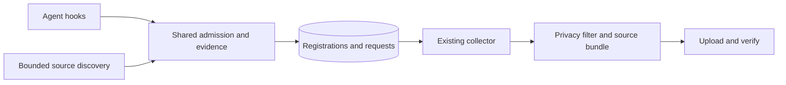

# Local session discovery: engineering proposal

> **Proposed; revised source contract.** Not implemented on the default branch. See the [documentation index](../../docs/README.md) for what exists today.

Status: proposed plan for review. Prepared 2026-10-01; source contract revised 2026-10-02. This proposal adds automatic discovery of new local Codex sessions to the background collector, with shared admission rules that can support other agents later. This document describes the intended behavior, not a claim that automatic discovery is available. Implementation work is tracked separately; it does not change this machine's capture configuration.

## Purpose

Make capture work after agent-archive setup for people who use the Codex desktop app and never open the Codex CLI to approve hooks. Keep hooks as a complementary source of timely lifecycle evidence. Give both paths one session identity, one admission decision, and the existing privacy-filtered publication pipeline.

The initial release supports Codex only. The discovery contract and state transitions must be agent independent; Claude Code and Cursor continue using their existing hooks until separately evaluated.

## Problem and current behavior

The collector already runs in the background, but normally processes sessions that hooks or explicit backfill have registered. Installing a hook does not establish that the agent has approved or executed it. A working background job therefore does not guarantee that new Codex sessions enter the archive.

| Observation | What it establishes | What it does not establish |
| --- | --- | --- |
| `hooks installed` | Hook definitions are present. | Codex trusts them or has run them. |
| `no sessions yet` | No eligible live registration has been observed. | Hook approval was denied; the user may have no eligible fresh session. |
| An imported session | Backfill can read at least that source. | Hooks work or automatic discovery works. |
| Background collector on | The scheduler is configured; scan timestamps provide separate liveness evidence. | Discovery or upload succeeded for this agent. |
| A desktop worktree outside an included directory | Its checkout path is outside the direct project rule. | Its main repository is excluded; Git worktree metadata may map it to an included repository. |

OpenAI documents trust review for non-managed hooks and the `/hooks` review flow in the CLI. The desktop slash-command reference does not list `/hooks`; that omission is not proof that every desktop version lacks a hook interface. Setup should not depend on users finding an undocumented desktop approval prompt. Sources checked 2026-10-01: [hooks](https://learn.chatgpt.com/docs/hooks), [slash commands](https://learn.chatgpt.com/docs/reference/slash-commands).

Relevant existing code:

- [Collector](../../internal/collector/collector.go) processes registered sources and replays pending admission intents.
- [Codex backfill discovery](../../internal/backfill/discover.go) locates rollout files and reads bounded headers.
- [Project resolution](../../internal/backfill/resolve.go) handles configured projects and Git worktrees.
- [Hook admission](../../internal/capture/hook.go) owns fresh-start admission and lifecycle evidence.
- [Session admission guide](../contributing/session-admission.md) distinguishes native start time from archive admission time.

## Scope

**Included:** new, eligible local Codex sessions; desktop and CLI validation; worktree resolution; hooks and discovery cooperating; explicit setup consent; bounded discovery; accurate status; compatibility with existing registrations, backfill, pause, retention, and destination changes.

**Deferred:** automatic discovery for Claude Code or Cursor, cloud retrieval, a new GUI onboarding application, filesystem watchers, runtime plugins, retroactive imports, and changes to the transcript privacy filter. Cloud capture remains a [separate proposal](cloud-capture.md).

“Local” means a supported session record read from a default or explicitly configured Codex home on this computer. It does not mean proven execution on this computer. The adapter validates source format, native identity, start time, and available import/fork/remote classifications. Identifiable unsupported histories remain available through deliberate backfill rather than automatic admission.

A recently copied or downloaded session whose supported metadata is indistinguishable from an ordinary record is eligible if it satisfies every other admission rule. Its original native start must fall within capture consent; copying old history never makes it fresh. This is an explicit source-trust boundary, not a cryptographic provenance promise. The user accepts this limitation; its frequency has not been measured. See the [bounded source investigation and decision](local-session-discovery-evidence.md).

## Principles and decisions

| Decision | Reason |
| --- | --- |
| Discovery runs in the existing background collector job. | One scheduler, retry mechanism, and upload pipeline. |
| Hooks remain useful but optional for automatic Codex admission. | They provide prompt/stop/end evidence and faster requests; discovery removes approval as an onboarding dependency. |
| Add a small compile-time adapter registry. | New agents supply source discovery and start evidence without duplicating policy. No dynamic plugin framework is needed. |
| Existing installations explicitly enable discovery through setup. | An upgrade must not silently broaden capture behavior. |
| Fresh setup enables discovery as part of selecting Codex, with a clear summary. | Users should not need to understand two capture mechanisms to get started. |
| Native start evidence governs discovery eligibility; admission time keeps its existing meaning. | Scan time cannot make an old session eligible. |
| Missing or invalid required metadata and identifiable unsupported classifications fail closed and are visible. | Preserve admission boundaries without requiring an unavailable proof of local execution. |
| Indistinguishable recent copies use ordinary eligibility rules. | Approved source homes are the capture boundary; native start, project and destination consent still apply. |
| No extra publication path. | Preserve filtering, checksums, source-first publication, metadata-last publication, and read-back verification. |

## Design

### 1. Shared source discovery, separate policy

Extract reusable source enumeration, bounded header parsing, and project/worktree resolution from backfill into lower-level packages. Backfill keeps its plan, confirmation, historical-import policy, and undo behavior. Automatic discovery supplies a different admission policy over the same source facts.

The dependency direction is CLI orchestration → discovery/admission → source catalog and state. The collector continues to consume registrations. Do not make collector import backfill: backfill already uses collector filtering, and sharing its orchestration would create a dependency cycle or mix import policy with automatic admission.

An adapter returns candidates and typed outcomes. The contract contains:

| Field | Meaning |
| --- | --- |
| Agent and native session ID | Identity within this machine's agent namespace. |
| Source descriptor | Source kind, stable source key, and private locator. A locator can identify a file or database record; it is not necessarily a transcript path. |
| Native start and evidence kind | An adapter-supported native timestamp and format facts for a qualifying source record; not proof of local execution. |
| Working directory | Input to shared project authorization. |
| Parent/fork/execution classification | Available facts used to reject identifiable unsupported imported, inherited, or remote histories. |
| Source fingerprint | A scheduling hint for retry and change detection, never proof of freshness. |

Adapters cannot authorize a project, select a destination, or register a session. Shared policy does that. Outcomes distinguish incomplete metadata, unsupported format, invalid identity, unavailable source, and a usable candidate. The API supports bounded enumeration with a continuation token and cancellation; it does not return all candidates in one in-memory slice.

Codex enumeration starts with the locations already supported by backfill: default and explicitly configured Codex homes, active rollout files, and archived rollout files. Persist configured homes so a scheduled process does not depend on the shell's current `CODEX_HOME`. Do not recursively search the user's home directory. Active and archived copies of one native session are one candidate with a deterministic preferred source and fallback if it disappears.

### 2. Eligibility across configuration changes

For a previously unregistered candidate, require all of the following:

1. Discovery is enabled for that agent and the configuration is valid, committed, and unpaused.
2. The bounded metadata identifies a supported session record in an approved source root, with consistent native ID, source identity, absolute working directory, and a valid native start timestamp. Identifiable unsupported imports, forks, child-session linkages, or remote records are rejected; lack of independent execution proof alone is not a rejection.
3. Shared project resolution yields an explicitly included project; the nearest applicable exclusion wins.
4. Native start falls within an authorized discovery interval for this agent, project, and destination.
5. No existing registration or removal record forbids admission.

Persist a discovery authorization generation for each effective agent/project/destination combination, with unpaused intervals inside that generation. An interval opens only when all capture permissions are effective. Disabling/re-enabling discovery, removing/reselecting an agent, excluding/reincluding a project, or changing destination creates a new generation. Only the current generation authorizes a new registration. Pause/resume closes and opens intervals within that generation. Setup and pause/resume must write these facts atomically with configuration, including crash recovery.

At initial enablement, the earliest permitted start is the latest of project activation, agent discovery enablement, and destination activation. Scan time is not an eligibility boundary. Pause closes admission intervals; resume opens new ones. A session begun during a pause remains ineligible after resume. A session begun before pause in a still-authorized destination may be discovered later. Previously registered sessions retain the current product behavior: they can catch up after resume, including activity written while paused.

Disabling discovery stops new discovery admission; removing the agent or project continues to control collection through existing configuration rules. Re-enabling begins a new generation at the enablement time; it does not admit unregistered sessions from an earlier generation or the disabled period. Unpaused intervals from before a pause remain usable only within the current generation. Registrations already assigned to another destination are not reassigned automatically. Use half-open intervals (`start <= native start < end`) so boundary behavior is deterministic.

Keep this fresh-start check in a named shared admission helper and extend the admission guard tests deliberately. After registration, existing boundary checks continue using `AdmittedAt` and `DestinationID` as specified by the admission guide. Do not scatter comparisons against `StartedAt` through collector or CLI code.

Clock anomalies need explicit outcomes: reject implausible future timestamps, record a content-free reason, and do not substitute mtime or discovery time. The supported skew tolerance must be fixed and tested before release. Intervals and native timestamps are local evidence, not cryptographic provenance against a malicious same-user process.

### 3. Project and worktree authorization

Use one resolver for backfill and automatic discovery. Resolve symlinks consistently with configured roots. Check direct project rules first, preserving nearer exclusions. For a surviving Git worktree, resolve its `.git` file and `commondir` to the main repository and apply the configured project rules there. Preserve both the actual checkout locator and the authorized project identity for capture.

Worktree mapping must not automatically include every directory under `~/.codex/worktrees`, infer authorization from an equal remote URL, or override an explicit exclusion on the checkout. Bound metadata reads and traversal depth, detect cycles, and avoid running Git while holding admission locks. A deleted checkout without trustworthy mapping is unresolved; skip it with a diagnostic. Do not guess its project from a filename.

### 4. One identity and atomic admission

The native-session index currently keys by native ID alone. Namespace new identity lookups by `(agent, native session ID)` within the local state store. Preserve existing archive IDs with a lazy, atomic legacy migration: accept a legacy mapping only after checking the registration's agent and native ID. An ambiguous or corrupt mapping produces a repair diagnostic, not an overwrite or a second upload. Removal-record lookups must remain effective across the migration.

Introduce a shared register-or-merge operation used by discovery, hooks, pending hook-intent replay, and backfill. The current `RegisterNewSession` operation is not sufficient as an insert-if-absent primitive: it can rewrite a registration. The shared operation must re-read state and configuration under the existing admission serialization and either:

- Create a fresh registration, allocate its archive ID, preserve the authorized destination, and queue collection durably.
- Return the existing compatible registration, merging only allowed source and evidence updates.
- Reject an identity conflict, tombstone, stale authorization generation, or incompatible project/destination.

Immutable fields include archive ID, original start, original admission, origin, destination, and import attribution. A discovery registration has `origin: discovery`; an imported registration remains imported when hooks subsequently fire. Source replacement requires matching identity and project evidence, not just a shared filename. If a crash separates registration from its first request, the next pass must still collect the registration; index and registration writes must have a defined recovery order.

All admission paths use the same lock order. Enumerate sources, read headers, resolve worktrees, and compute repository keys outside `hooks.lock`. Hold the admission lock only for bounded revalidation and local writes, one candidate at a time. Yield between candidates and skip contended lock acquisition; retain the candidate for retry. Never hold that lock while parsing a full transcript or accessing storage.

### 5. Hooks and discovery cooperating

| Arrival order | Required result |
| --- | --- |
| Hook, then discovery | One registration; discovery can repair a missing source locator without changing origin or destination. |
| Discovery, then hook | One registration; hook evidence is added without resetting admission or changing discovery origin. |
| Concurrent hook and discovery | The atomic operation chooses one creation; the other merges or returns it. |
| Backfill, then either path | Preserve import attribution and admission rules; do not relabel the session as a fresh automatic capture. |
| Removal, then discovery | Honor retention/undo removal records; no resurrection. |

Track hook observation separately from origin. A later prompt, stop, or other supported hook on a discovery registration can establish hook observation even if its start hook never ran. The evidence must be durable and independent of whether an upload succeeds. Legacy hook registrations keep their current interpretation; imported registrations alone do not prove hooks work.

Discovery cannot manufacture stop/end events, final-response evidence, or proof of transcript completeness. Existing parser-derived timestamps and available subagent links remain usable, with gaps reported honestly. Emit discovery provenance and a specific missing-hook-evidence gap where appropriate; do not reuse an import-only gap or make `ImportedAt` appear on a discovery session. Later hook observation does not retroactively prove earlier lifecycle coverage. Automatic admission of child sessions requires an admitted parent and validated linkage; otherwise leave them unsupported in the first release. Hooks continue to improve timeliness and evidence when approved.

### 6. Collector orchestration, budgets, and recovery

Run discovery as a bounded stage of the existing collector job, before processing the registrations it admits. Preserve collector serialization, configuration reloads, pending-intent recovery, cancellation, and shutdown handling. Registration is local work: a storage outage must not prevent eligible sessions from being registered and later uploaded. Separate storage initialization failure from discovery failure in the orchestration and status.

Start with a five-second discovery budget and at most 256 header probes per scheduled pass, with cancellation between candidates. These are proposed defaults, not measured guarantees. Reuse bounded header reads, cap directory entries processed per batch, and measure the resulting I/O and memory. Discovery must leave time for already queued captures, verification, and retention. Large backlogs continue fairly across passes rather than repeatedly selecting the same first files.

Use a private, bounded catalog of source fingerprints, cached metadata, retry outcomes, and durable continuation. Revisit partial files after changes or bounded retry delays. Fingerprints detect ordinary replacement/truncation; periodic bounded header revalidation handles replacements that retain the same size and timestamps. Reconciliation also handles moves to archived storage, directory changes, and stale caches. Neither mtime, a dated filename, nor an enumeration cursor establishes fresh-start eligibility. If a cursor is invalidated, reconciliation must restore coverage without silently skipping files.

The common case should avoid rereading unchanged historic headers and never fully parse an unregistered ineligible transcript. Known eligible registrations continue through existing change detection and filtering; discovery must not enqueue an urgent request on every scan. Bound and prune cache records, preserving removal records according to existing retention semantics. A failed or interrupted pass must not record unfinished reconciliation as successful.

Classify errors per root and candidate. A missing optional source root differs from an unreadable configured root. State write failures must be retried, not recorded as a permanent candidate rejection. Persist last attempt, last completed reconciliation, pending work, and sanitized error categories. Do not count a discovery-root error as a failed archived session or let it conceal successful collection for another agent.

### 7. Security and privacy

Discovery reads agent-owned sources with the current user's existing filesystem permissions. It adds no credential, executes no hook definition, and never modifies Codex hook trust. User consent is agent-archive's capture setup, including the selected destination and projects. Hook approval remains a separate Codex decision.

Before project authorization, inspect only bounded metadata needed for identity, start, execution classification, and working directory. Keep those facts in private local state; they can themselves reveal project paths. After authorization, use the existing transcript filter and publication pipeline. Raw transcript content must not appear in the catalog, logs, diagnostics, or temporary discovery files.

Treat file content and locators as untrusted input: allow expected regular sources, reject devices/FIFOs and path escapes, bound records and traversal, and revalidate identity when the source is reopened for collection. Explicitly configured symlinked Codex homes may be resolved to approved source roots; per-file symlinks must not permit reads outside those roots. Apply equivalent limits to worktree metadata. Sanitize OS errors before display because they often contain paths and native IDs.

The feature's guarantee is scoped to approved local source homes and the current user's trust boundary. It neither proves where a task executed nor prevents that user or a process with the same permissions from fabricating a transcript. An indistinguishable recent copy can be uploaded under the same consent rules as an ordinary record. Protect against historical capture, malicious source contents, and unintended path traversal without claiming tamper-proof provenance.

### 8. Setup and status

Fresh setup keeps the agent and project choices users already understand. When a supported Codex installation is selected, the capture summary states: **“Automatically archive new Codex tasks found in these local Codex homes, in these projects, to this destination. Existing history requires backfill. Qualifying recent copied sessions may also be archived.”** Establish the discovery authorization interval only when setup commits. For an unsupported installation, explain the limitation and retain the hook setup path; do not show automatic capture as ready. Preserve setup rollback and interrupted-transaction recovery.

For existing installations, show discovery as an explicit opt-in during setup refresh/reconfiguration. Keep current hooks operating until enabled. Enabling discovery is forward-looking and must not auto-run backfill. Noninteractive setup requires an explicit discovery choice; do not infer consent from a hook-only configuration. Final CLI flag names and configuration fields belong to implementation review.

The success instruction is **“Start a new local Codex task in an included project; capture normally appears after the next background scan.”** Show hook review as optional for additional lifecycle evidence, with the documented CLI path available in details. Do not label capture blocked merely because hook trust is unknown.

| State | Proposed status guidance |
| --- | --- |
| Enabled, scans healthy, no eligible task yet | Automatic capture ready; start a new task in an included project. |
| Discovered and registered, upload pending | Task found; show pending upload or storage failure separately. |
| Published and read back | Capture verified; show its verified timestamp. |
| Hooks installed, never observed | Hook approval unknown; optional lifecycle enhancement. |
| Discovery disabled | Offer setup enablement; retain existing hook instructions. |
| Discovery degraded or coverage backlog | Show the root error or pending scan coverage, with a concrete recovery action. |
| Unsupported or unresolved source | Explain the category in verbose status; suggest deliberate backfill where appropriate. |

Keep overall capture, discovery health, hook observation, and storage verification distinct in machine-readable status. Preserve existing JSON fields where their meanings remain valid; version incompatible semantic changes. In particular, `HookObserved` must no longer be inferred from every non-import registration. Status must never claim complete source coverage merely because the scheduled job ran.

## Compatibility and schema work

- Legacy configurations have discovery disabled until explicit enablement. New optional fields must decode safely; older binaries must refuse unsupported discovery state rather than flatten authorization history during a config rewrite. Define the rollback/version policy before release.
- Existing registrations and archive IDs remain stable. Empty origin remains legacy hook origin. Existing imports, publication requests, and removal records retain their meanings.
- Add discovery origin to relevant registration, source, metadata, and JSON schema definitions where those fields are emitted. Audit every `!Imported()` branch: automatic capture does not imply hook execution.
- Update parser/filter/adapter or schema versions only according to the actual output changes and the [version rules](../maintainers/versions.md). Do not assume that an optional origin enum extension is understood by every older reader.
- Update the admission guide, adding-an-adapter guide, architecture, setup/help, status reference, and privacy documentation when the feature is implemented. This proposal makes no changes to current user documentation.

## Phases and work packages

| Phase | Work | Exit condition |
| --- | --- | --- |
| 0. Bound source investigation | Inspect pinned producer formats and disposable execution/import/copy probes; record actual desktop versus CLI coverage. | Document supported metadata, identifiable rejection cases, and the indistinguishable-copy limitation. Missing execution provenance alone does not block discovery. |
| 1. Shared foundations | Extract source catalog/resolver; add namespaced index migration and atomic admission; define durable authorization intervals and rollback compatibility. | Existing hook/backfill behavior passes; races, pause, exclusions, destination changes, and tombstones covered. |
| 2. Codex discovery | Add adapter, bounded incremental scan, retry/reconciliation, and local admission independent of storage availability. | Correct capture with hooks absent or unapproved; no duplicate uploads; measured resource budgets. |
| 3. Onboarding and status | Transactional enablement, existing-install opt-in, capture verification, separate discovery/hook health, docs and schemas. | Desktop user can enable capture and verify a new task without opening Codex CLI. |
| 4. Release acceptance | Disposable machine and bucket acceptance, upgrade/rollback checks, failure injection, and benchmark evidence. | All correctness/security gates pass; remaining fidelity limitations are explicit. |

Package boundaries are targets, not a line-count estimate. Use the following PR boundaries and integration order, preserving newer default-branch session identity and lifecycle behavior:

| PR | Scope | Dependency and activation |
| --- | --- | --- |
| A. Contract and evidence | Revised source-trust contract and bounded investigation. | Standalone documentation change against main. |
| B. Shared foundations | Source readers/resolver, identity/admission, authorization lifecycle, writer compatibility, and provenance. | Separate branch against main; incorporate A's contract before merge. Discovery remains disabled. |
| C. Codex discovery | Bounded adapter/scanner and collector integration. | Stacked on B; discovery remains disabled. |
| D. Setup, status, and activation | Consent UX, status, supported record formats, documentation, and release evidence. | Stacked on C; activation waits for all acceptance gates below. |

Merge in A → B → C → D order. B does not need A's documentation commits in its ancestry; C and D must be reconciled with their merged prerequisites before retargeting. Keep production activation behind admission, real desktop, storage, compatibility, and performance acceptance. A documented inability to distinguish recent copies does not block activation; unavailable desktop acceptance still does. Ship only the Codex adapter. Future agents must meet the same contract and acceptance suite, with their own source-specific probes.

| Area | Implementation ownership |
| --- | --- |
| Source facts and resolution | Extract from `internal/backfill/discover.go` and `resolve.go` into reusable lower-level packages; keep historical import policy in backfill. |
| Admission and identity | Shared policy below CLI; `internal/state` owns namespaced indexes, migration, atomic registration, and removal-record checks. `internal/capture` retains hook interpretation and evidence. |
| Configuration lifecycle | `internal/config`, setup journal, and CLI setup/pause/resume persist and validate authorization generations. |
| Scheduled work | CLI collector orchestration invokes discovery; `internal/collector` continues filtering and publishing registrations. |
| Provenance and UX | Archive types/parser, JSON schemas, CLI status/setup, and contributor/user docs change together. |

## Review findings incorporated

The review strengthened the initial idea of scanning Codex files on each collector pass:

| Concern | Design change |
| --- | --- |
| A scan can make old history look newly admitted. | Require supported native start evidence within the current authorization generation and unpaused intervals. |
| Hooks, backfill, and discovery can race or overwrite provenance. | Share atomic register-or-merge, namespaced identities, and explicit immutable fields. |
| A naïve full scan grows with years of history and competes with hooks. | Budget enumeration/header work, persist fair continuation, reconcile caches, and keep discovery I/O outside admission locks. |
| Desktop users cannot tell whether capture actually works. | Make discovery the supported default for fresh Codex setup, with independent registration, publication verification, and hook-observation states. |
| New files may contain copied, forked, or remote history. | Reject identifiable unsupported cases and pre-consent native starts. Accept indistinguishable qualifying recent copies and disclose the source-trust limitation. |
| Upgrades can broaden capture or destroy eligibility history on rollback. | Require existing-install opt-in and a tested writer/schema compatibility policy. |

## Acceptance criteria

### Correctness and security

- With hooks absent or unapproved, a supported new desktop or CLI Codex task in an included project is discovered, filtered, published, and read back successfully.
- Old sessions, resumed old sessions, sessions begun during pause/disabled intervals, excluded projects, and identifiable unsupported imported/inherited/remote histories are not automatically admitted. Invalid or missing start evidence never falls back to file timestamps.
- A supported recent copy without a reliable distinguishing classification follows ordinary admission rules. Tests cover rejection of a pre-consent copy, deduplication of an already registered copy, and eligibility of an otherwise qualifying recent copy; no test claims proof of local execution.
- External worktrees map to the included main repository only through validated metadata; explicit checkout exclusions win. Symlink escapes, cyclic/oversized Git metadata, FIFOs, malformed headers, and identity conflicts fail safely.
- Every ordering of hook, discovery, backfill, retry, and crash recovery yields one archive identity and preserves admission, origin, and destination. Different agents with the same native ID remain distinct.
- Retention and backfill-undo tombstones prevent resurrection. Destination switch and project reinclude do not cause historical capture into the new authorization period.
- Pause and setup races revalidate the current configuration before durable admission. A crash cannot leave partially granted discovery permissions.
- Raw content, source paths, and native IDs do not leak through routine diagnostics; all published content still passes the existing filter. Discovery adds no unfiltered upload channel.

### Performance and recovery

- Benchmark 1,000, 10,000, and 100,000 rollout files, including unchanged history, incomplete headers, and a burst of new sessions. Record wall time, CPU, memory, bytes read, candidate coverage, and delay to registration.
- A warm idle scan performs no full transcript parsing; memory and per-pass discovery work remain bounded as history grows. Sustained arrivals and repeated interruptions do not starve archived directories or queued uploads.
- On the release acceptance machine, discovery holds the admission lock for a target p99 below 50 ms and causes no hook lock deadline failures under concurrent start/stop load. If that target fails, revise batching/locking before release.
- A supported new task on a healthy warm catalog registers within two scheduled passes. Cold-start/backlog status exposes delayed coverage; the benchmark establishes a documented convergence envelope rather than a false universal latency promise.
- Storage outages still allow durable local admission; subsequent recovery uploads once. Permission errors, cache corruption, moved files, truncated/replaced files, scheduler restart, and clock anomalies produce accurate recoverable outcomes.

### Onboarding and compatibility

- A desktop-only user completes agent-archive setup, starts a task, and sees verified capture without hook approval. The setup summary explains source homes, project scope, destination, existing-history exclusion, and the qualifying-recent-copy limitation.
- An upgrade does not enable discovery or import history silently. Existing hook-only installations and imports continue working.
- Status differentiates ready, found/pending, verified, degraded discovery, and unknown hook approval. An import or collector heartbeat does not falsely establish automatic-capture verification.
- Schema fixtures and migration tests cover legacy registrations, ambiguous indexes, old readers/binaries, and rollback behavior. Use disposable state and storage for all development acceptance; do not alter a developer's live archive configuration.

## Risks and open questions

| Question | Proposed resolution or release gate |
| --- | --- |
| Which Codex versions expose supported identity/start/classification metadata? | Phase 0 documents pinned formats and actual probe coverage. Do not default-enable unsupported formats or infer execution location from source presence. |
| Can a recent copy look identical to a session executed here? | Yes for the metadata tested. Accept otherwise qualifying records, disclose the limitation, and preserve native-start consent. Further useful classifications can be added without claiming universal detection. |
| Can inherited records precede a new fork's start despite a fresh session ID? | Reject automatic fork admission initially unless the adapter proves a safe content boundary. Decide broader fork support separately. |
| How much authorization history is necessary? | Persist intervals needed for delayed admission and tombstones; define bounded compaction that fails closed for expired/unprovable starts. Never silently use current scan time. |
| Can older binaries safely preserve the new state? | Set an explicit minimum writer version or incompatible config version if needed; test refusal and rollback before release. |
| What are safe scan defaults and clock tolerances? | Proposed budgets require benchmark and clock-failure evidence before becoming release defaults. |
| Should Claude Code and Cursor gain discovery next? | Decide from onboarding need, fidelity, and source cost. Their adapters must pass the shared admission contract; no automatic expansion in this release. |

The design aims for reliable, explainable capture within supported source formats and explicit capture consent. Its long-term extension point is the source-evidence adapter and shared policy, with explicit compatibility gates whenever an agent changes its format.
