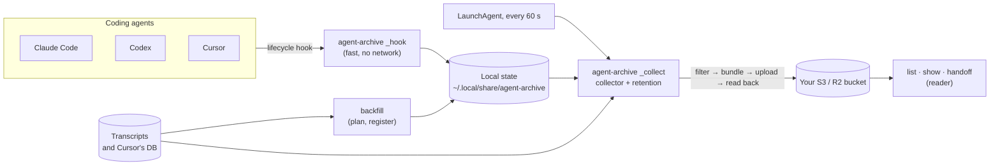

# Architecture

agent-archive is one Go binary, `cmd/agent-archive`, with everything else in
`internal/`. The design rationale is in the [archive design](../design/archive-spec.md);
this page is the map.

## The paths through it

1. **Hook** (`internal/cli` `_hook`). An app runs `agent-archive _hook
   --harness <app>` at session start, stop, and similar events. The hook checks the
   configuration, records the session (`registrations/`) or queues work
   (`requests/`) under `hooks.lock`, and returns within milliseconds. It does
   no filtering or uploading, never touches the network, and never writes to
   stdout.
2. **Collector** (`internal/collector`, run by `_collect` or `sync`). Under
   `collector.lock`, for each registered session it reads the transcript,
   filters it through the app's adapter, builds a source bundle, derives
   metadata, and publishes source then metadata. It then reads both back to
   verify them. Retention runs after each pass.
3. **Reader** (`internal/reader`). `list`, `show`, and `handoff` read the
   bucket: metadata first, and a source only when asked, verified against
   the metadata's checksum.
4. **Backfill** (`internal/backfill`). Plans an import of existing
   transcripts read-only, then registers the confirmed sessions in short holds
   of `hooks.lock`; the collector uploads them like any other.

## Packages

| Package | Owns |
| --- | --- |
| `archive` | The privacy filter and adapters (one per app), source bundles, metadata derivation, the normalized view, and handoff rendering. No filesystem, network, or CLI dependencies, so it is fully testable on fixtures. |
| `collector` | The scan, build, publish loop; change detection; local session state (`LocalStore`); subagent capture. |
| `retention` | Deleting superseded snapshots and expired sessions, with the remote metadata as the source of truth. |
| `storage` | The object-store contract and the S3/R2 implementation; checksums, read-back, bucket privacy inspection. Keys are relative to the configured prefix. |
| `credentials` | Resolving storage credentials: AWS profiles, and R2 secrets in the Keychain (cgo, Security.framework). |
| `config` | `config.json`: the one record of how this Mac is set up. |
| `local` | The data directory, atomic durable writes, and file locks. |
| `hooks` | Planning, installing, and removing hook entries and the LaunchAgent. |
| `evidence` | Skill inventories and snapshots, as privacy-filtered evidence. |
| `cursorstore` | Reading Cursor's `state.vscdb` without writing to it or beside it. |
| `backfill` | Discovery, the import plan, registration, and undo. |
| `reader` | Listing metadata and loading verified sources, with a disposable metadata cache. |
| `cli` | Every command and the only package that touches process state (args, stdio, the clock, the home directory, launchctl), all through an injectable `Env`. |
| `doclinks` | A test that the documentation's relative links resolve. |

## Invariants worth knowing before you change anything

- Nothing leaves the Mac except what an adapter's filter kept. Unknown keys
  are dropped and named, never passed through. See
  [privacy](../security/privacy.md) and [versions](../reference/versions.md).
- The bucket's `metadata.json` is the live pointer. A source is uploaded
  before the metadata that points at it, and deleted only after it is no
  longer pointed at.
- Pending publication bytes are frozen before the first remote write, so a
  retry uploads byte-identical objects.
- Local writes are atomic and durable (temporary file, fsync, rename,
  directory fsync). One unreadable state file is quarantined, not fatal.
- Hooks must be fast and silent: an app waits for them.
- Every side effect in `cli` goes through `Env`, so tests never touch the real
  home, launchd, Keychain, or a bucket.
